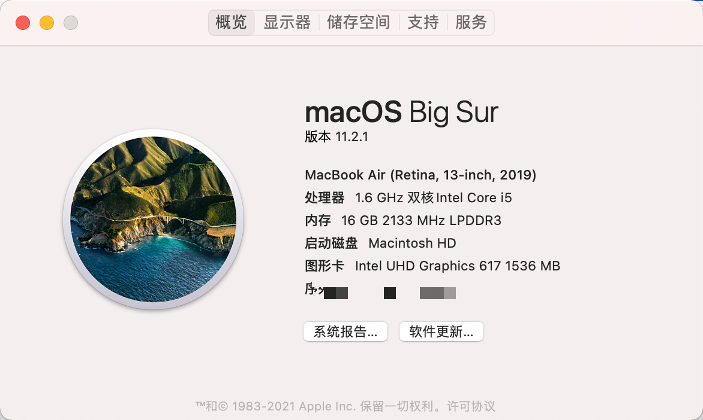

安装 `python ` 解释器和 `pycharm` 是学习python的第一步。安装`python`会我们提供开发`python`程序的工具,诸如`python`解释器、`pip`包管理器等等工具，而`pycharm`是开发`python`所使用的集成开发环境，为我们提供诸如代码补全、智能提示等功能，使用`pycharm`可以让我们在开发`python`程序的时候如虎添翼，事半功倍。

#  `python` 的安装和配置

## 前言

### 关于 Mac 中的 Python 解释器

很多的 `Linux` 发行版都是自带 `Python` 解释器，比如 `Ubuntu18` 自带了 `python2.7` 和 `python3.6` 。同样的，Mac 系统自带了 `python2.7` ，所以当你在终端输入 `python` 的时候，便会出现看到如下一幕：

```bash
➜  ~ python

WARNING: Python 2.7 is not recommended. 
This version is included in macOS for compatibility with legacy software. 
Future versions of macOS will not include Python 2.7. 
Instead, it is recommended that you transition to using 'python3' from within Terminal.

Python 2.7.16 (default, Dec 21 2020, 23:00:36) 
[GCC Apple LLVM 12.0.0 (clang-1200.0.30.4) [+internal-os, ptrauth-isa=sign+stri on darwin
Type "help", "copyright", "credits" or "license" for more information.
>>> 

```

显然我们是不需要 `python2.7` 的，首先是因为这个版本已经被淘汰，而且也和新的 `python3` 并不兼容，它的存在知识历史遗留问题。从他的警告提示中也可以之后，在未来的 `mac` 系统中，将会移除这个老旧的 `python` 版本，使用 `python3` 取而代之。

> 在各种 Linux 发行版中已经完成替换了，比如 Ubuntu20 中只有一个 python3.8 了。

显然，现在的学习是需要使用 `Python3` 的，这也就是这篇教程出现的原因。

### 关于Python版本的选择

如果看这篇教程的同学对 `Java` 有所了解，便知道 `Java8` 发布于 2014 年，但是到目前为止一直是最流行的 `Java` 版本。造成这个现象的原因很多。


不同于 `Java` ，`Python` 的每个版本都是长期支持版，所以对于 `Python` 的版本选择，可以追求也推荐最新的版本。

## 下载 `python` 


本教程使用的是从官网下载的 `python` 版本

下载页面 `https://www.python.org/downloads/` ，打开之后会看到大量的python发行版本，目前尚在维护更新的是`3.6` 、`3.7`、 `3.8`、 `3.9` 


选择最新的 `python` 版本，此处以 `3.9.5` 版本为例，点击 `download` 按钮，然后进入新页面后下拉到底，选择适合自己的 `操作系统` 版本


本教程以 `mac` 平台 `64位` 版本为例，下载 [macOS 64-bit Intel installer](https://www.python.org/ftp/python/3.9.5/python-3.9.5-macosx10.9.pkg)  `安装器` （installer）至本地

> 除了 [macOS 64-bit Intel installer](https://www.python.org/ftp/python/3.9.5/python-3.9.5-macosx10.9.pkg) 还有一个[macOS 64-bit universal2 installer](https://www.python.org/ftp/python/3.9.5/python-3.9.5-macos11.pkg)，如果你的电脑是新的苹果M1芯片的版本，就需要下载该版本。查看是Intel芯片还是苹果芯片的方法是点击左上角 `苹果图标` —> `关于本机`，查看处理器条目。
>
> 

除了在官网下载 `Python` 解释器，你还知道哪些方式？


> TIPS：下载 `python` 有两种途径：
> 1. 在`python`的官网下载
> 2. 下载`anaconda`版本的`python`
> 
> 相较于官方版本，`anaconda`版本的`python`自带了很多的数据分析方面的第三库，适合数据分析师，但是体积庞大，需要超过`5GB`的硬盘空间。而是用官方版本的`python`可以获得最小环境，大约只占用`150MB`硬盘空间

## 安装 `python`


下载后的文件名为 `python-3.9.5-macosx10.9.pkg` ，双击运行`安装器` ,


一直选择继续即可，直到安装结束。

此时，打开终端，输入 `python3` 即可看到:

```shell
➜  ~ python3
Python 3.9.5 (v3.9.5:0a7dcbdb13, May  3 2021, 13:17:02) 
[Clang 6.0 (clang-600.0.57)] on darwin
Type "help", "copyright", "credits" or "license" for more information.
>>> exit()
➜  ~ 
```

> 输入 `python3` 会进入 python 的交互解释器，再次输入 `exit()` 可以退出交互解释器。

查看 `python3` 和 `pip3` 的版本和位置

```bash
➜  ~ python3 --version
Python 3.9.5
➜  ~ pip3 --version
pip 21.1.2 from /Library/Frameworks/Python.framework/Versions/3.9/lib/python3.9/site-packages/pip (python 3.9)
➜  ~ which python3
/Library/Frameworks/Python.framework/Versions/3.9/bin/python3
➜  ~ which pip3
/Library/Frameworks/Python.framework/Versions/3.9/bin/pip3
```


#  `pycharm` 的安装和配置

`pycharm`是`python`开发工程师的首选，一款好用的工具往往可以使得事半功倍,可以帮助我们进行Web后端、网络爬虫、数据分析等方面的开发。

## 版本选择

`pycharm`提供了收费的`专业版`和免费的`社区版`，专业版本提供了对`Django`框架的支持，在编写`Django`应用的时候，拥有更好的智能补全以及模板语法的代码提示。因此我们选择专业版

> TIPS：即便没有付费，也可以试用使用 `pycharm` 专业版本30天
>
> 接下来的 `Django-Twitter` 项目中推荐使用专业版，因为专业版提供了对 `Django` 和 `Vagrant` 的支持。


## 下载 `pycharm`

下载地址：https://www.jetbrains.com/pycharm/download/#section=windows

点击`Download`按钮便可进行下载


双击便可进行安装，一路`next`即可

## 创建第一个项目并运行

**步骤一**： 选择新建项目，并命名为`HelloWorld`


**步骤二**：先选择自己喜欢的 `位置`，再选择 `先前配置的解释器`，并点击三个点


**步骤三**：选择 `系统解释器` ，点击 `确定`


**步骤四**：创建项目


## 运行python代码

在打开`HelloWorld`文件夹的时候，`pycharm`为我们自动创建了一个名为`main.py` 脚本，此时我们便可直接运行这个脚本，来领域一下`python`的魅力。

使用输入快捷键 `⌃ Control+⇧ Shift+R` 便可以运行，输出如下图所示。


### 创建并运行自己的python脚本

接下来，我们用`pycharm`为我们自己创建脚本

在`HelloWorld`右键，鼠标悬停于`New`，并点击`Python File`


输入001并回车


在新的文件001.py中输入如下语句,并使用快捷键`⌃ Control+⇧ Shift+R`运行该脚本

```python
print("HelloWorld")
```


便可获取输出


## 插件推荐


### 中文插件

如果你的英文不太好，又想快速上手pycharm，但又担心乱点导致一些乱七八糟的情况，那你可以尝试安装中文插件。

#### 安装方式

点击`pycharm`主界面左上角`file` -> `settings`-> `plugins`，在搜索框输入`chi`，安装第二个2.5M下载量 的插件（此为官网插件），选择`Accept`，安装完成后，需要点击 `Restart IDE` 按钮 重启pycharm即可。


### 彩虹括号

下面的代码充斥了很多的圆括号和方括号，让人看了头疼，需要花时间看左括号是和哪个右括号匹配

```python
tweet.refresh_from_db()
self.assertEqual(tweet.likes_count, 3)
response = self.dongxie_client.get(tweet_url)
self.assertEqual(response.data['likes_count'], 3)
response = self.linghu_client.get(newsfeed_url)
self.assertEqual(response.data['results'][0]['tweet']['likes_count'], 3)
response = self.dongxie_client.get(newsfeed_url)
self.assertEqual(response.data['results'][0]['tweet']['likes_count'], 3)
```

此时，如果有一个彩虹括号，通过不同的颜色来区分不同的括号对，那将大大方便我们阅读代码。

#### 安装方式

点击`pycharm`主界面左上角`file` -> `settings`-> `plugins`，在搜索框输入`rain`，安装`Rainbow Brackets`插件。


## 为`pycharm`选择不同的解释器

真实的开发很难使用一个解释器变打遍天下。

可能你接受了一个公司的老项目，用的还是`python3.5`，而今天刚刚立项的新项目打算使用`python3.9`

另外还有的项目跑在类似`docker`容器，又或者需要我们使用`ssh`、`vagrant`等虚拟技术。对面纷繁复杂的开发环境，`pycharm`都能游刃有余,当需要不同开发环境的时候，只需要配置用过解释器即可。


# 总结

至此，我们完成了`python`的下载和配置，使得安装的`python`成为我们的系统`python`解释器

并且下载并配置了`pycharm`，使得`pycharm`可以使用我们刚刚安装的`python`，为我们运行代码

