# 开发环境搭建与项目初始化

本次项目我们使用的开发环境是，`Vagrant ` + `VirtualBox` + `PyCharm` + `Ubuntu 18.04`。


注意：

- pycharm 需要选择专业版，不然没有 Django 相关的智能补全和运行、调试功能，也没有 Vagrant 相关的连接选项

  > 专业版是收费的，但是提供了30天的免费试用。购买的话，个人许可证差不多是8.9刀一个月、89刀一年
  >
  > 购买链接：https://www.jetbrains.com/pycharm/buy/?fromIDE#personal?billing=yearly
  >
  > 如果是学生或者开源开发者可以申请免费许可证，更多优惠请参考：https://www.jetbrains.com/pycharm/buy/#discounts?billing=yearly

- 截至目前2021-08-1， `Virtualbox`尚不支持搭载苹果自研m1处理器的 Mac 电脑，如需要请移步`Docker`版本的教程。

- 有些同学会问：

  - 我已经有一个 ubuntu18 的机器了，能不能直接用那个，不用 vagrant 啊？

    可以，但是最好不要，可以把 vagrant 当作一个知识点

  - 能不能直接在物理机上做开发？

    不行，统一开发环境老师和助教才有可能回答你的问题。

  - 能不用 anaconda、virtualenv来替代 vagrant啊？

    不行。vagrant 是虚拟机，anaconda、virtualenv是虚拟环境，两者完全不是一回事，没有可比性。


## 前期准备

### 1. 安装 `Virtualbox`

下载地址: `https://www.virtualbox.org/wiki/Downloads`


打开下载连接后，选择适合自己操作系统的版本。

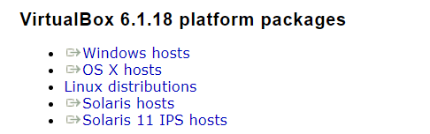

如操作系统为 Windows，我们可以选择 Windows hosts，下载完成后会获得如下图所示的安装包。


双击运行该安装包。

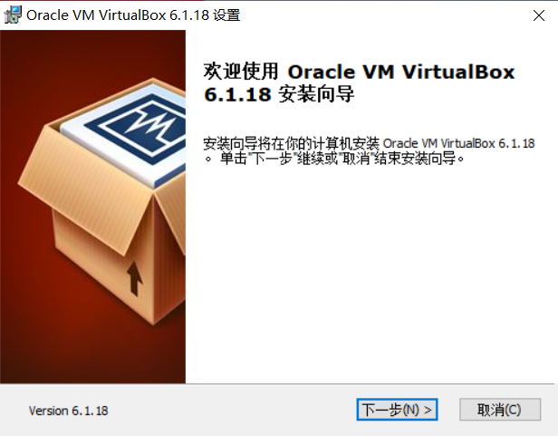

全部默认一直点击`下一步`。

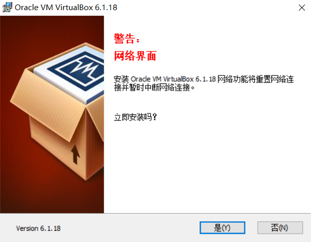

点击`是`，此处`Virtualbox `会为我们安装虚拟网卡。

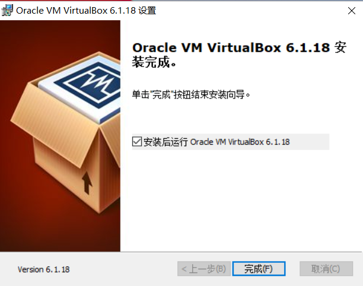

此时便完成了 `Virtualbox ` 安装。

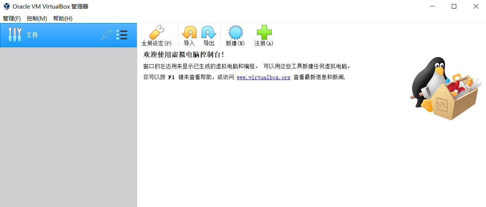


> 关于为什么使用 `Virtualbox `而不是 `VMware` ？
>
> ​	因为 `Virtualbox `是开源免费的，`VMware`是商业收费的，而且想在 `VMware` 上使用 `Vagrant` 还要二次收费。

### 2. 安装 `Vagrant `

下载地址： `https://www.vagrantup.com/downloads`


选择适合自己操作系统的版本，此处以 `Windows` 为例，点击 `Download` 按钮下载。

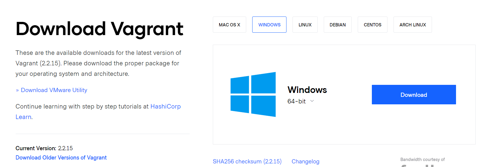

下载完成后会得到 `vagrant_2.2.14_x86_64.msi` 文件。


双击打开进行安装。

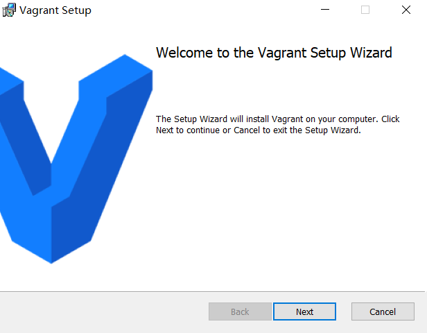

之后一路 `Next` 就可以了。

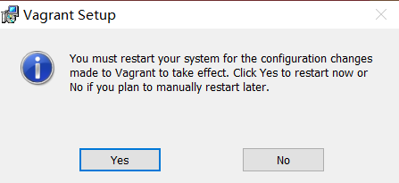

安装完成后需要`重启` 计算机。

 

重启之后打开终端，输入 `vagrant --version` ，看到有版本号输出，就说明安装成功了。

```powershell
PS C:\Users\27> vagrant --version
Vagrant 2.2.14
```


> `Vagrant` 并不提供虚拟化技术，本质上是一个虚拟机外挂，通过虚拟机的管理接口来管理虚拟机，让用户更轻松的进行一些常用配置，比如：CPU/Memory/IP/DISK等分配。并且提供了一些其它的管理操作：比如开机运行指定命令，镜像二次打包，插件编写等等。


### 3. 创建代码仓库

首先我们打开我们的 github 页面，点击左上角的 + ，再点击 New repository 按钮创建一个新的仓库。

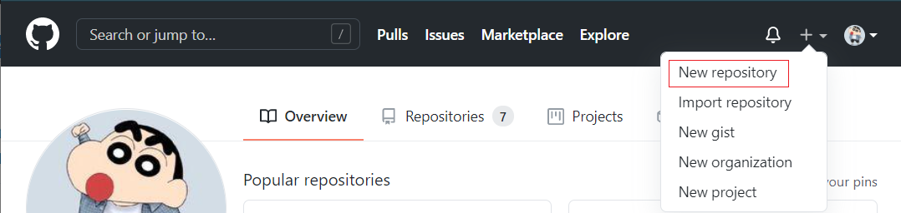

接下来会让你填写一些信息，比如我们代码仓库的名字 django-twitter，然后添加一个 `README.md` 文件.

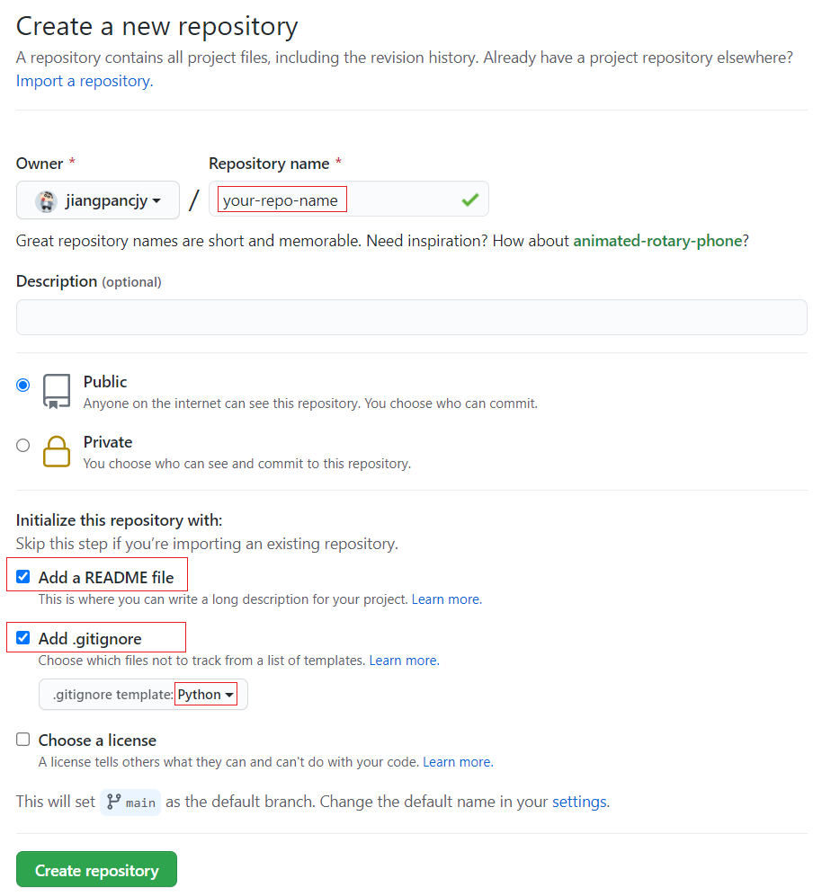

填写完相关信息后，点击 Create repository 按钮，我们就创建了一个代码仓库。

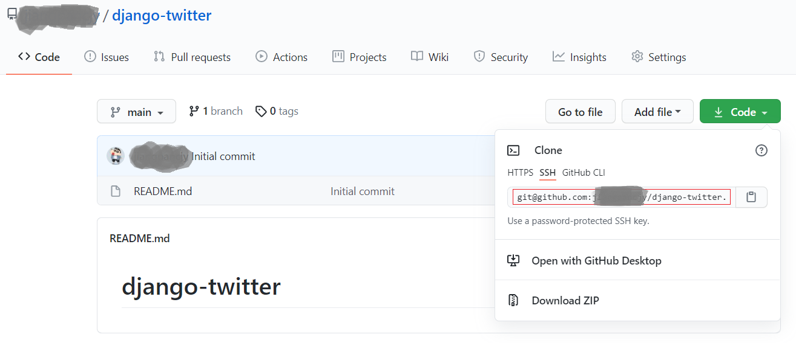

> 注意选SSH，而不是左边的HTTPS 

### 4.克隆代码仓库

然后我们可以复制上图红框的部分，使用 `git clone` 命令将代码仓库复制到本地电脑的合适位置：

```shell
git clone git@github.com:yourname/django-twitter.git
```

如果 clone 成功，可以看到如下图所示提示，下图的操作我们是在宿主机的 Git Bash 上进行操作。

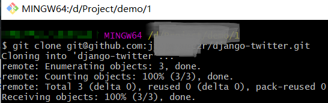

此时我们本地的目录结构大致为：

```shell
django-twitter
├── .git 
├── .gitignore
└── README.md
```

> 这里 `.git` 是一个隐藏文件夹，如果你在文件管理器中看不见这个文件夹，需要打开文件管理器的`查看隐藏文件`选项。
>
> 接下来的项目开发都是在自己的仓库进行的。

### 5.配置公钥（可选）

如果你在使用使用Git 克隆项目的时候遇到下面的问题，就需要配置以下公钥了。

```bash
git clone git@github.com:jiuzhangsuanfa/twitter-term-1.git
Cloning into 'twitter-term-1'...
The authenticity of host 'github.com (192.30.255.112)' can't be established.
RSA key fingerprint is SHA256:nThbg6kXUpJWGl7E1IGOCspRomTxdCARLviKw6E5SY8.
Are you sure you want to continue connecting (yes/no/[fingerprint])? yes
Warning: Permanently added 'github.com,192.30.255.112' (RSA) to the list of known hosts.
git@github.com: Permission denied (publickey).
fatal: Could not read from remote repository.

Please make sure you have the correct access rights
and the repository exists.
```

或者这样也需要配置公钥，跟着下面的内容配置公钥就好了。


**添加公钥的方法**

- 步骤一：在终端运行下面的命令，把邮箱换成自己的

  ```bash
  ssh-keygen -t rsa -C "email@email.com"
  ```
> 一路回车，不需要输入任何内容，默认会在~/.ssh路径下生成`id_rsa` 和`id_rsa.pub`文件。`id_rsa.pub`就是我们需要的。


  

- 步骤二：查看 `~/.ssh`路径下的`id_rsa.pub`文件,并复制文件内容

  

  > 生成的`id_rsa.pub`一般在`~/.ssh/`目录下。
  >
  > 注意：需要把从 **ssh-rsa**开始到**邮箱**的所有内容都复制

- 步骤三：打开自己的Github主页，选择设置


- 步骤四：选择左侧的`SSH and GPG keys`，在选择`New SSH key`


- 步骤五：把刚刚那个公钥复制到这里面就好了，title随便填，无所谓。点击`Add SSH key`保存。


> 注意：因为生成的公钥是来自我们的宿主机，可以通过宿主机的git程序clone、pull代码
>
> 但是如果想要通过虚拟机来clone、pull、push代码的话，还需要让虚拟机也生成公钥，并添加到Github中。
>
> 因为虽然宿主机和虚拟机虽然都运行在同一台电脑上，但是是物理上是隔绝的，都有各自的git程序和密钥作用范围。
>
> 但是因为在.git 里面会记录一些和主机相关的信息，因为是共享文件夹，所以再在虚拟机中执行git指令的时候，有些信息会对不上就会报错，所以尽量在宿主机机器上操作吧！

## 创建虚拟机

> Vagrant是一款用于构建及配置虚拟开发环境的软件，基于Ruby,主要以命令行的方式运行。
>
> 主要使用Oracle的开源VirtualBox虚拟化系统，与Chef，Salt，Puppet等环境配置管理软件搭配使用， 可以实行快速虚拟开发环境的构建。
>
> 早期以VirtualBox为对象，1.1以后的版本中开始对应VMware等虚拟化软件，包括Amazon EC2之类服务器环境的对应。

直接在 VirtualBox 中安装系统要使用 ISO 镜像文件，在 Docker 中安装系统要使用 image 文件，而要通过 Vagrant 安装虚拟机便是通过 BOX 就像文件。接下来让我们来通过 Box 文件来安装虚拟机吧！


### 1. 准备 Box 镜像

#### a. 下载 Box 镜像 

下载地址：`https://app.vagrantup.com/hashicorp/boxes/bionic64`

>  此处下载的 `Ubuntu` 不是从 `Ubuntu` 官网下载的 ISO 镜像，而是 `Vagrant ` 官网打包好的 `box` 镜像，我们的项目使用的操作系统为 Ubuntu 18.04 LTS。

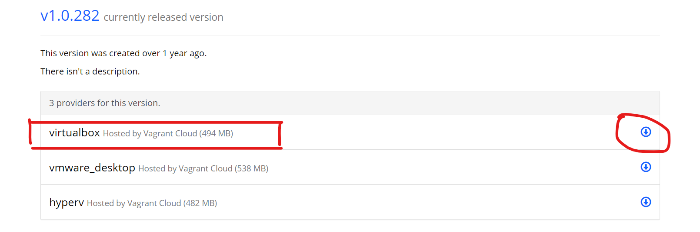

此处我们选择 `virtualbox Hosted by Vagrant Cloud (494 MB)` ，点击右侧的下载按钮便可进行下载，下载完成后可以得到如下图所示的文件：


由于默认的文件名并不是特别好记，因此我们可以将文件名改为 `bionic64.box`，并将其放到我们的 `django-twitter` 下面，当前目录结构如下所示：

```shell
django-twitter
├── .git
├── .gitignore
├── bionic64.box
└── README.md
```

> .git

#### b. 添加 Box 镜像

在当前路径下，我们也可以使用 Git Bash 来运行 Vagrant 的命令，当然你也可以是使用任意你喜欢的终端。

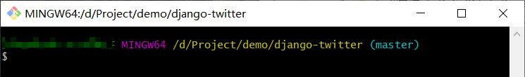

> 注意要进入到 `django-twitter` 中执行我们的文件。

我们可以使用如下命令将 Box 镜像添加到我们的 Vagrant 中：

```shell
vagrant box add hashicorp/bionic64 bionic64.box
```

> `hashicorp/bionic64` 是我们给 Box 取的名字，hashicorp 是开发 Vagrant 这个产品的公司名字
>
> `bionic64.box` 是 Box 文件所在的路径，这里就相当于是相对路径。

添加后，我们可以用下面的命令进行查看：

```shell
vagrant box list
```

看到下图说明添加成功。

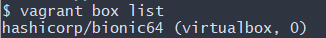


### 2. 虚拟机启动前配置

> `Vagrantfile`、`provision.sh`、`requirements.txt `三个文件不需要自己修改，直接从九章仓库中获取即可，下文有介绍，不要着急。

#### a.  Vagrantfile

`Vagrantfile` 文件如下所示：（项目中要用到`Vagrantfile`配置文件会在仓库中提供，届时复制粘贴即可）

```ruby
# -*- mode: ruby -*-
# vi: set ft=ruby :

# All Vagrant configuration is done below. The "2" in Vagrant.configure
# configures the configuration version (we support older styles for
# backwards compatibility). Please don't change it unless you know what
# you're doing.
Vagrant.configure("2") do |config|
  # The most common configuration options are documented and commented below.
  # For a complete reference, please see the online documentation at
  # https://docs.vagrantup.com.

  # Every Vagrant development environment requires a box. You can search for
  # boxes at https://vagrantcloud.com/search.
  config.vm.box = "hashicorp/bionic64"

  # Disable automatic box update checking. If you disable this, then
  # boxes will only be checked for updates when the user runs
  # `vagrant box outdated`. This is not recommended.
  # config.vm.box_check_update = false

  # Create a forwarded port mapping which allows access to a specific port
  # within the machine from a port on the host machine. In the example below,
  # accessing "localhost:8080" will access port 80 on the guest machine.
  # NOTE: This will enable public access to the opened port
  # config.vm.network "forwarded_port", guest: 80, host: 8080

  # Create a forwarded port mapping which allows access to a specific port
  # within the machine from a port on the host machine and only allow access
  # via 127.0.0.1 to disable public access
  # config.vm.network "forwarded_port", guest: 80, host: 8080, host_ip: "127.0.0.1"

  # Create a private network, which allows host-only access to the machine
  # using a specific IP.
  # config.vm.network "private_network", ip: "192.168.33.10"

  # Create a public network, which generally matched to bridged network.
  # Bridged networks make the machine appear as another physical device on
  # your network.
  # config.vm.network "public_network"

  # Share an additional folder to the guest VM. The first argument is
  # the path on the host to the actual folder. The second argument is
  # the path on the guest to mount the folder. And the optional third
  # argument is a set of non-required options.
  # config.vm.synced_folder "../data", "/vagrant_data"

  # Provider-specific configuration so you can fine-tune various
  # backing providers for Vagrant. These expose provider-specific options.
  # Example for VirtualBox:
  #
  # config.vm.provider "virtualbox" do |vb|
  #   # Display the VirtualBox GUI when booting the machine
  #   vb.gui = true
  #
  #   # Customize the amount of memory on the VM:
  #   vb.memory = "1024"
  # end
  #
  # View the documentation for the provider you are using for more
  # information on available options.

  # Enable provisioning with a shell script. Additional provisioners such as
  # Ansible, Chef, Docker, Puppet and Salt are also available. Please see the
  # documentation for more information about their specific syntax and use.
  # config.vm.provision "shell", inline: <<-SHELL
  #   apt-get update
  #   apt-get install -y apache2
  # SHELL
end
```

我们打开 `Vagrantfile` 文件，对其中的一些配置进行说明。

- 原文件第15行，这里是我们前面给虚拟机取的名字：

```ruby
config.vm.box = "hashicorp/bionic64"
```

- 原文件第26行，这里给宿主机和虚拟机之间建立了端口映射：

```ruby
config.vm.network "forwarded_port", guest: 80, host: 8080
```

> 后续使用中会使用 `config.vm.network "forwarded_port", guest: 8000, host: 80`，将虚拟机（guest）的8000端口映射为物理机的80端口

- 原文件第35行，这里为虚拟机指定一个私有网络 IP：

```ruby
config.vm.network "private_network", ip: "192.168.33.10"
```

- 原文件第46行，这里给宿主机和虚拟机之间建立了目录映射，我们项目中默认不修改，Vagrant 会自动在宿主机的 `django-twitter` 和虚拟机的 `/vagrant` 之间建立映射：

```ruby
# config.vm.synced_folder "../data", "/vagrant_data"
```

- 原文件第66行，这里可以设置启动虚拟机时，要执行的脚本文件：

```ruby
config.vm.provision :shell, path: "provision.sh"
```

> 这些配置说明只要看看就好，都是 vagrant 自己生成，实际使用中会修改他们，而不是使用默认配置

#### b. provision.sh

`provision.sh` 文件如下所示：

```bash
#!/usr/bin/env bash

echo 'Start!'

sudo update-alternatives --install /usr/bin/python python /usr/bin/python3.6 2

cd /vagrant

sudo apt-get update
sudo apt-get install tree

# 安装配置mysql8
if ! [ -e /vagrant/mysql-apt-config_0.8.15-1_all.deb ]; then
	wget -c https://dev.mysql.com/get/mysql-apt-config_0.8.15-1_all.deb
fi

sudo dpkg -i mysql-apt-config_0.8.15-1_all.deb
sudo DEBIAN_FRONTEND=noninteractivate apt-get install -y mysql-server
sudo apt-get install -y libmysqlclient-dev

if [ ! -f "/usr/bin/pip" ]; then
  sudo apt-get install -y python3-pip
  sudo apt-get install -y python-setuptools
  sudo ln -s /usr/bin/pip3 /usr/bin/pip
else
  echo "pip3 已安装"
fi

# 升级pip，目前存在问题，read timed out，看脸，有时候可以，但大多时候不行
# python -m pip install --upgrade pip
# 换源完美解决
# 安装pip所需依赖
pip install --upgrade setuptools -i https://pypi.tuna.tsinghua.edu.cn/simple
pip install --ignore-installed wrapt -i https://pypi.tuna.tsinghua.edu.cn/simple
# 安装pip最新版
pip install -U pip -i https://pypi.tuna.tsinghua.edu.cn/simple
# 根据 requirements.txt 里的记录安装 pip package，确保所有版本之间的兼容性
pip install -r requirements.txt -i https://pypi.tuna.tsinghua.edu.cn/simple


# 设置mysql的root账户的密码为yourpassword
# 创建名为twitter的数据库
sudo mysql -u root << EOF
	ALTER USER 'root'@'localhost' IDENTIFIED WITH mysql_native_password BY 'yourpassword';
	flush privileges;
	show databases;
	CREATE DATABASE IF NOT EXISTS twitter;
EOF
# fi


# 如果想直接进入/vagrant路径下
# 请输入vagrant ssh命令进入
# 手动输入
# 输入ls -a
# 输入 vi .bashrc
# 在最下面，添加cd /vagrant

echo 'All Done!'
```

> 注意，这里我们安装并配置了 Mysql ，添加了一个 root 用户，并且把密码设置为 `yourpassword`
>
> 你可以在虚拟机的终端使用 `mysql -u root -p"your password" ` 登录数据库

#### c. requirements.txt

`requirements.txt` 文件如下所示：

```
Django==3.1.3
mysqlclient==2.0.3
```


#### d. 获取配置文件（必选）

上面提到的配置文件可以从九章提供的阶段性代码仓库中获取，本阶段所需的文件可以从 `1-initial-vagrant` 分支中获取。

仓库地址：https://github.com/jiuzhangsuanfa-org/twitter-term-1

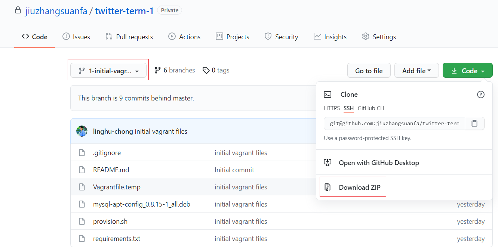

我们可以先选中分支 `1-initial-vagrant`  ，然后采用下载压缩包的方式将文件下载到本地。

接着将这个分支下的文件 (除了 `README.md`) 复制到 `django-twitter` 目录下。（即把下载的zip中的`.gitignore   `、 `mysql-apt-config_0.8.15-1_all.deb`   、`provision.sh`、`requirements.txt`和 `Vagrantfile`这五个文件复制到 `django-twitter` 目录下）

将复制过来的 `Vagrantfile.temp` 文件改成 `Vagrantfile` 。

> 注意国外用户需要去掉 `provision.sh` 文件中的 `-i https://pypi.tuna.tsinghua.edu.cn/simple`
>
> 这个是给国内用户准备的清华镜像，加速国内用户下载速度的，国外可能适得其反。

示意图：


此时的目录结构如下所示：

```shell
django-twitter
├── .git
├── .gitignore
├── bionic64.box
├── mysql-apt-config_0.8.15-1_all.deb
├── provision.sh
├── README.md
├── requirements.txt
└── Vagrantfile
```

> 你那里可能会有一个 `.idea` 的一个隐藏文件夹，忽略它，它是 pycharm 自动生成的，用于记录一下项目的个性化配置的。
>
> 此处可以修改.gitignore追加一行 `.idea/`。 `.idea`文件夹是Pycharm的配置文件

### 3. 启动虚拟机

通过`vagrant up`命令，我们可以启动虚拟机：

```shell
PS C:\Users\27\Desktop\TwitterProject\django-twitter> vagrant up
Bringing machine 'default' up with 'virtualbox' provider...
==> default: Machine already provisioned. Run `vagrant provision` or use the `--provision`
==> default: flag to force provisioning. Provisioners marked to run always will still run.
.......
```

> 注意：在 `Vagrantfile` 文件所在路径执行该命令。因为我们可以在机器上装很多个虚拟机，执行`vagrant up`命令会首先寻找当前路径下的`Vagranfile`文件指向的虚拟机。

这个过程可能会比较慢，因为在启动的时候会去执行 `provision.sh` 文件，帮我们指定 Python 版本并安装依赖，以及初始化数据库。当看到如下界面时，说明虚拟机已启动成功。

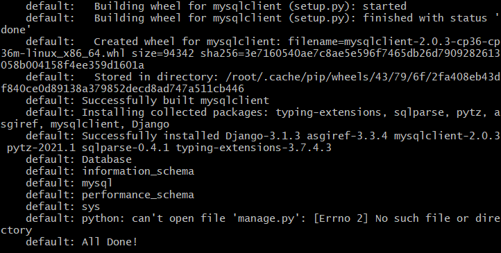

此时打开  `Virtualbox` 可以看到，我们之前添加的 `ubuntu18` 并且正在运行中。

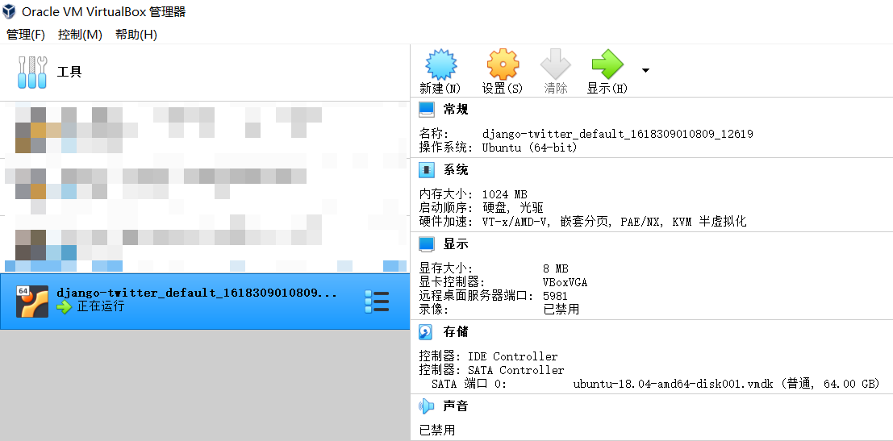

> ```bash
> Stderr: VBoxManage.exe: error: A NAT rule of this name already exists
> VBoxManage.exe: error: Details: code E_INVALIDARG (0x80070057), component NATEngineWrap, interface INATEngine, callee IUnknown
> VBoxManage.exe: error: Context: "AddRedirect(Bstr(strName).raw(), proto, Bstr(strHostIp).raw(), RTStrToUInt16(strHostPort), Bstr(strGuestIp).raw(), RTStrToUInt16(strGuestPort))" at line 1911 of file VBoxManageModifyVM.cpp
> ```
>
> 如果你在开机过程中遇到如下错误，重启一下电脑即可解决。
>
> mac用户的话，也可以用如下命令解决：
>
> ```bash
> sudo "/Library/Application Support/VirtualBox/LaunchDaemons/VirtualBoxStartup.sh" restart
> ```
> 如果遇到如下错误：
>
> ```bash
> sudo: VirtualBoxStartup.sh: command not found
> ```
>
> 可以改用：
>
> ```bash
> cd /Library/Application Support/VirtualBox/LaunchDaemons
> sudo "./VirtualBoxStartup.sh" restart
> ```

通过以下命令，我们可以进入到虚拟机当中：

```shell
vagrant ssh
```

进入虚拟机后，我们可以看到如下图所示的界面（可能略有不同）

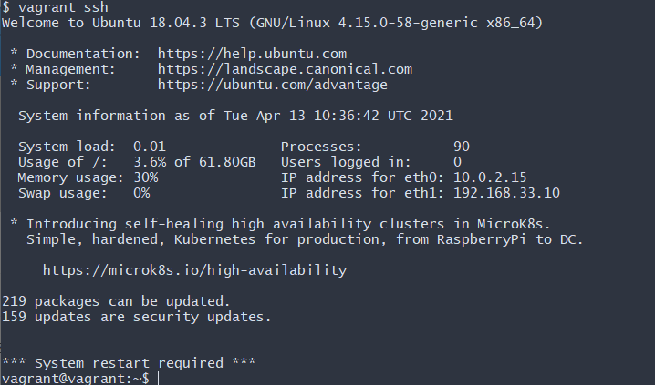

然后我们可以以检查一下 Python 的版本是否正确，使用如下命令：

```shell
python --version
```

Ubuntu 18.04 默认的 Python 版本是 2.7，现在我们可以看到 Python 为 3.6

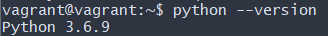

使用以下命令检查 Django 版本：

```shell
python -m django --version
```

可以看到我们的 Django 版本为 `requirements.txt` 文件中指定的版本

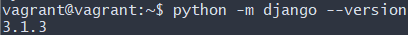

此时让我们了看看 Ubuntu 环境下的目录结构：

```shell
vagrant
├── bionic64.box
├── .git
├── .gitignore 
├── mysql-apt-config_0.8.15-1_all.deb
├── provision.sh
├── README.md
├── requirements.txt
├── .vagrant
│   ├── bundler
│   ├── machines
│   └── rgloader
└── Vagrantfile
```

相比之前多了一个 `.vagrant` 文件夹，这是在 Vagrant 启动后自动生成的。

> .vagrant 的目录比较复杂，这里就不展开了


### 4. 虚拟机启动后配置

#### a. 允许远程登入（必选）

通过以下命令打开 `sshd_config` 文件

```shell
sudo vim /etc/ssh/sshd_config
```

将文件中的 `PasswordAuthentication` 选项设置为 `yes` ，并去掉前面的注释。


#### b. 设置高亮显示（可选）

通过以下命令打开 `.bashrc` 文件

```shell
sudo vim ~/.bashrc
```

将文件中的 `force_color_prompt` 选项设置为 `yes` ，并去掉前面的注释。


#### c. 更换软件源（国外用户不选）

如果是国内的用户，可以修改以下 `APT` 包管理器的软件源，可以加速软件的安装和下载。

- **备份源列表**

  Ubuntu 配置的默认源并不是国内的服务器，下载更新软件都比较慢。首先备份源列表文件 `sources.list`：

  ```shell
  sudo cp /etc/apt/sources.list /etc/apt/sources.list.backup
  ```

- **修改源列表**

  使用以下命令编辑 `sources.list` 文件：

  ```shell
  sudo vim /etc/apt/sources.list
  ```

  打开后的 `sources.list` 文件如下所示：

  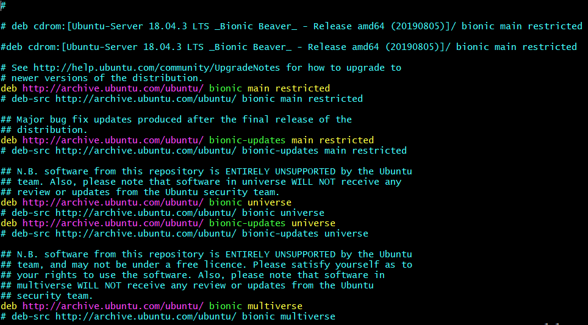

  然后我们可以将其中的软件源替换为国内的软件源，比如下面的中科大源：

  ```shell
  deb https://mirrors.ustc.edu.cn/ubuntu/ bionic main restricted universe multiverse
  deb-src https://mirrors.ustc.edu.cn/ubuntu/ bionic main restricted universe multiverse
  deb https://mirrors.ustc.edu.cn/ubuntu/ bionic-updates main restricted universe multiverse
  deb-src https://mirrors.ustc.edu.cn/ubuntu/ bionic-updates main restricted universe multiverse
  deb https://mirrors.ustc.edu.cn/ubuntu/ bionic-backports main restricted universe multiverse
  deb-src https://mirrors.ustc.edu.cn/ubuntu/ bionic-backports main restricted universe multiverse
  deb https://mirrors.ustc.edu.cn/ubuntu/ bionic-security main restricted universe multiverse
  deb-src https://mirrors.ustc.edu.cn/ubuntu/ bionic-security main restricted universe multiverse
  deb https://mirrors.ustc.edu.cn/ubuntu/ bionic-proposed main restricted universe multiverse
  deb-src https://mirrors.ustc.edu.cn/ubuntu/ bionic-proposed main restricted universe multiverse
  ```

编辑完成之后，输入如下命令，更新软件源

```bash
sudo apt-get update
```


#### d. 修改虚拟机的 `CPU ` 数量（可选）

通过 `Vagrant` 配置的虚拟机默认只用了一个 `cpu`核心 ，这样性能会比较低，可以在  `Virtualbox ` 修改。

在对应虚拟机关机的状态下，选择 `设置` ->  `系统`  -> `处理器`  调节处理器数量。一般都可以设置4个CPU。

> 可以通过以下命令，关闭虚拟机：
>
> ```shell
> sudo shutdown -h now
> ```

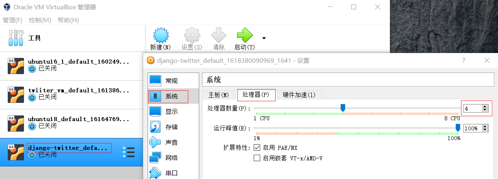


#### d. 远程登录（可选）

重新启动虚拟机后，可以使用任意的 SSH 终端软件 (MobaXterm、Termius、Xshell、PuTTY、SecureCRT) 链接虚拟机，虚拟机的 IP 是我们之前设置的私网 IP `192.168.33.10`，用户名和密码默认是 `vagrant`。

> 此步骤，可以用`vagrant ssh` 命令替代，因此是可选操作。

下面用 MobaXterm 来链接我们的虚拟机，首先点击 `Session`

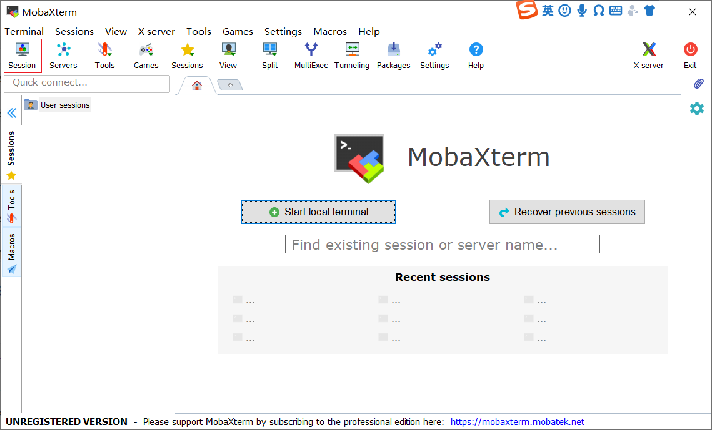

然后点击 `SSH`

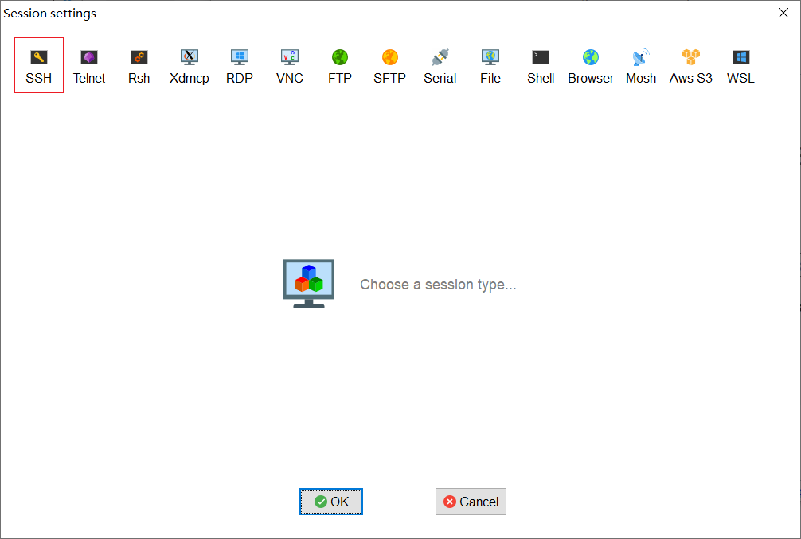

接着输入虚拟节的 IP，点击 OK

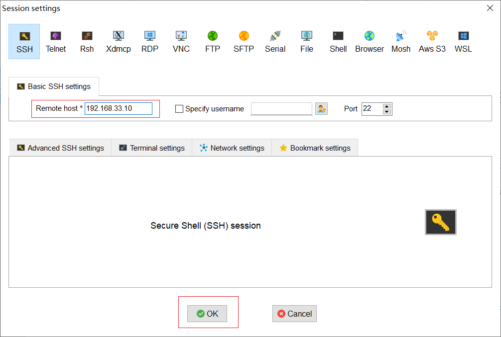

最后输入用户名和密码，即可登入成功

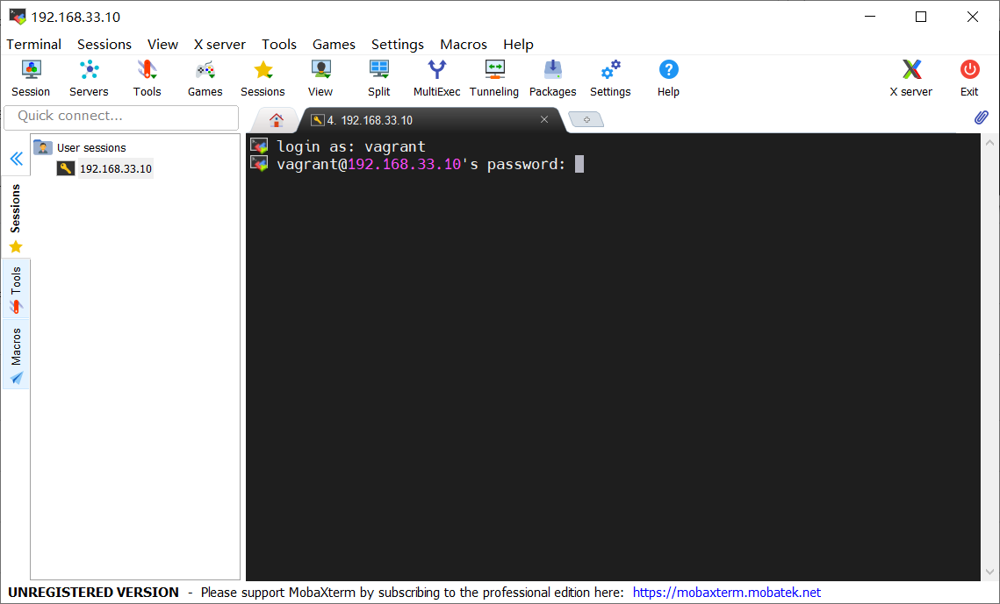

成功后的界面大致如下所示

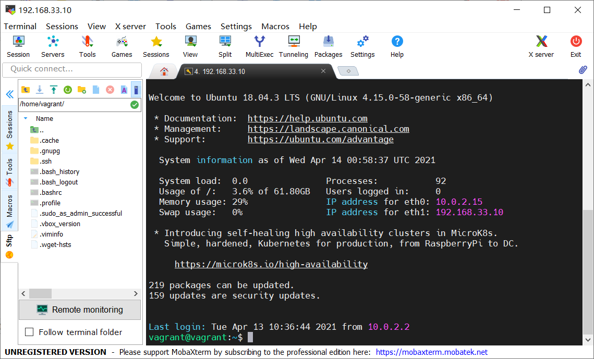

接着我们可以通过如下命令进入 `/vagrant` 目录下：

```shell
cd /vagrant
```

可以发现虚拟机这个目录的结构和宿主机上的 `django-twitter` 的目录结构是一样的。

**虚拟机：**

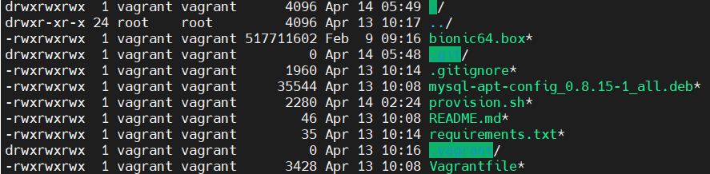

**宿主机：**

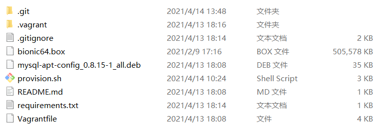


### 5.你需要了解的一些细节

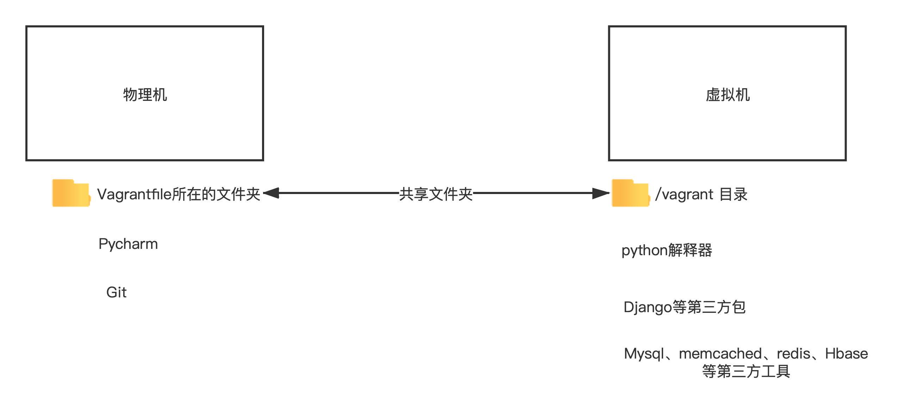


通过使用 vagrant，会在物理机和虚拟机之间建立起一个共享通道，连接我们物理机 Vagrantfile 文件所在文件夹和 虚拟机的 /vagrant 文件夹（是/vagrant，不是～/vagrant哦）

这样我们就可以在物理机使用 pycharm 可视化开发，而是需要在虚拟机的文本命令行界面开发。而python解释器、django、mesql等等工具都是装在虚拟机中的，开发环境和我们的物理机做了很好的隔绝。

## 提交代码

到目前为止，我们已经用 Vagrant 将开发环境搭建好了，接下来我们先将这些文件提交到我们的代码仓库吧。

> 确保此时的`.gitignore`文件的开头是这样。千万不要把`bionic64.box`文件提交上去，400多MB太大了。	`.vagrant`文件夹无所谓，提交也行，不提交也行。
>
> 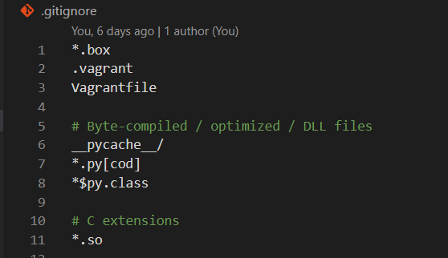

首先我们可以先用宿主机上的 Git Bash 查看一下我们本地代码仓库的状态：

```shell
git status
```

本地仓库的状态如下图所示

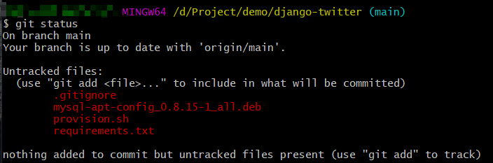

可以看到当前我们所在的分支是 `main` 分支，并且提示有四个文件可以提交。

> 为什么只提示四个文件需要提交呢？因为在我们的 `.gitignore ` 文件中规定了哪些文件会被忽略，比如当前路径下的 `.vagrant` 文件夹、和以 `.box` 结尾的文件等。

我们在做开发时不会在主分支下开发，所以我们先新建一个分支 `1-initial-vagrant`

```shell
git checkout -b 1-initial-vagrant
```

如下图所示

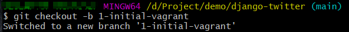

可以看到我们创建了一个新分支并切换到了新分支上。然后我们将当前路径下的所有文件提交到暂存区：

```shell
git add .
```

然后再次查看本地仓库的状态，如下图所示

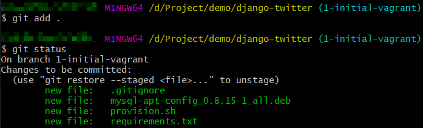

可以看到原先的四个文件全部都提交到了暂存区，接下来我们把文件提交到本地仓库：

```shell
git commit -m "initial vagrant"
```

如下图所示

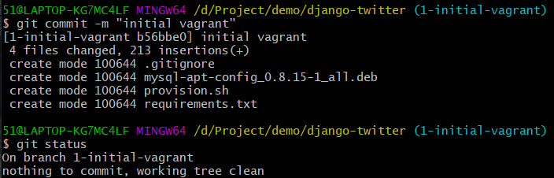

再次查看本地仓库时，发现已经没有文件需要提交，接着我们把本地仓库的更细推送到远程仓库，即我们的 GitHub 仓库：

```shell
git push -u origin 1-initial-vagrant
```

如下图所示

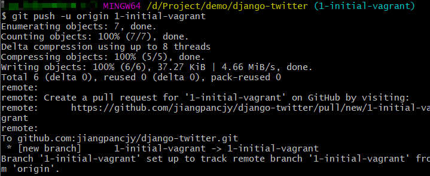

看到上图的信息，说明我们的代码推送成功了。接着我们来到 github 页面提交一个 pull request (简称 PR)。

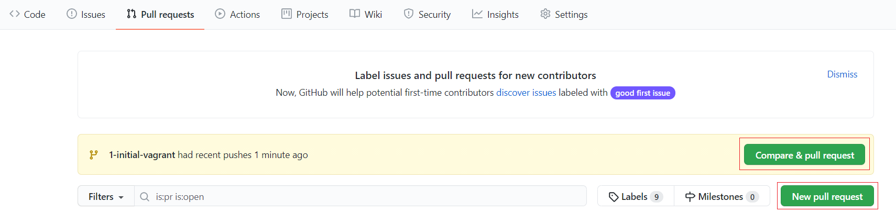

点击创建 PR 后，我们需要填写一下你提交 PR 的目的。

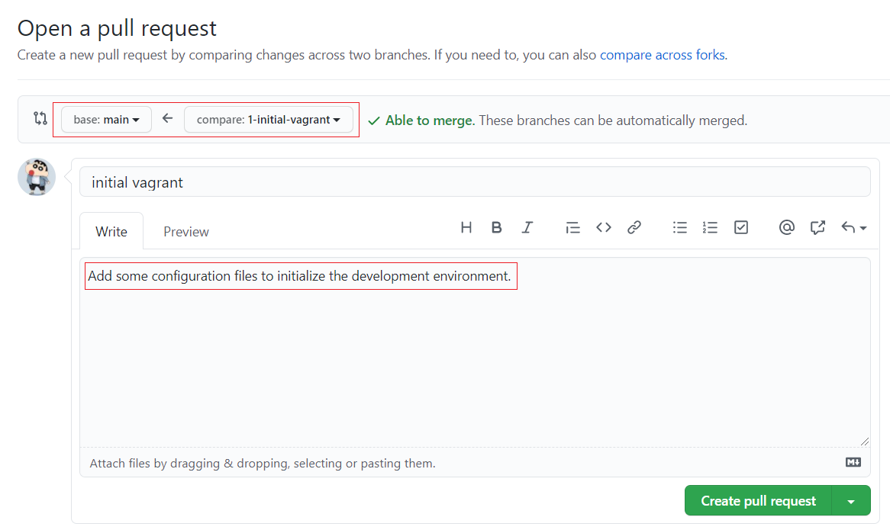

填写完相关的信息后，我们可以点击右下角的 Create pull request。

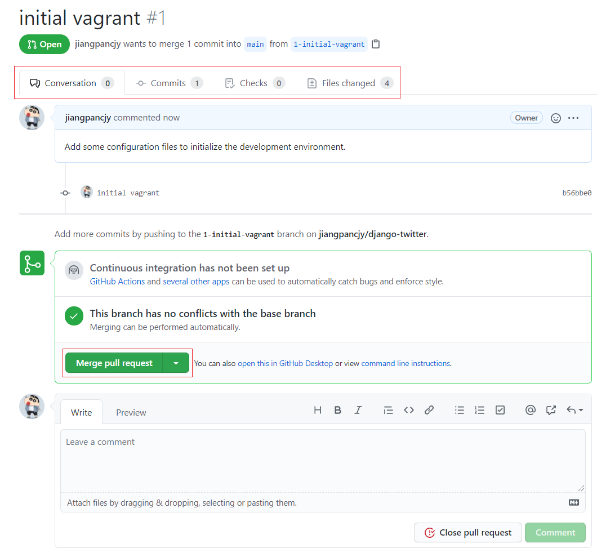

在上图所示的界面中，我们可以浏览我们提交的 PR，比如我们点击 Files changes，可以查看我们改动的代码。

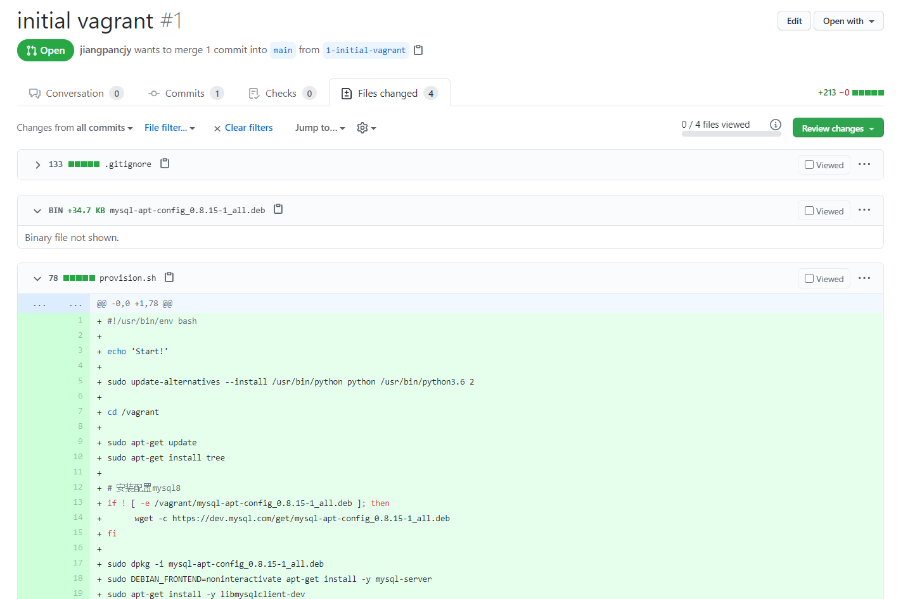

上图所示的操作我们通常称之为 review 代码，当确认你的代码无误后，就可以 merge 了。点击 Merge pull request 按钮，你提交的代码就合并到了主分支当中了。

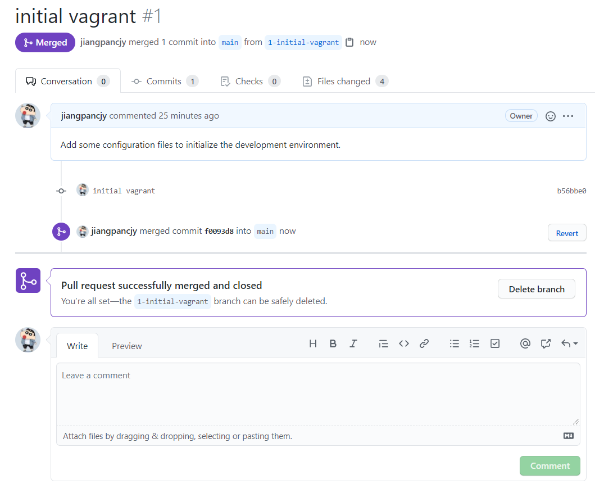


## 初始化项目

> 接下来我们会在两个地方执行我们的命令，Git 和 Vagrant 的命令我们通常会在 Git Bash 中执行，Django 和 Linux 命令我们会在 MobaXterm 中执行。

### 1. 创建项目

接下来我们要开始从零开始创建一个项目了，在此之前我们需要创建一个新的分支 `2-initial-django` ，使用宿主机上的 Git Bash

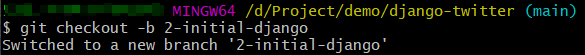

然后在 MobaXterm 中使用以下命令在当前目录下创建一个名为 `twitter` 的项目：

```shell
django-admin startproject twitter .
```
> django 安装在 虚拟机中而不是物理机，所以，要使用 `django-admin` 必须要在虚拟机的环境下执行。
>
> 创建的工程是在`/vagrant`文件夹下，不是`/home/vagrant`哦。
>
> 不要忘记后面有一个 `.` 点哦。

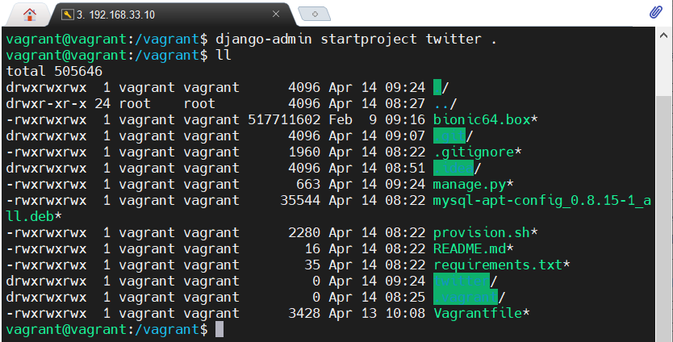

此时的代码结构为：

```shell
vagrant
├── bionic64.box
├── .git
├── .gitignore
├── manage.py
├── mysql-apt-config_0.8.15-1_all.deb
├── provision.sh
├── README.md
├── requirements.txt
├── twitter
│   ├── asgi.py
│   ├── __init__.py
│   ├── settings.py
│   ├── urls.py
│   └── wsgi.py
├── .vagrant
└── Vagrantfile
```

可以看到多了一个 `twitter` 文件夹和 `manage.py` 文件。

### 2. 修改项目配置文件

接下来我们可以使用宿主机上的 PyCharm 打开 `django-twitter` 目录，并修改 `twitter/settings.py` 文件，

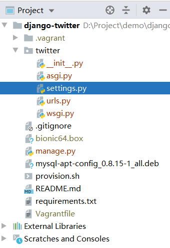

将其 `DATABASES` 配置信息为虚拟机上的 MySQL:

```python
DATABASES = {
    'default': {
        'ENGINE': 'django.db.backends.mysql',
        'NAME': 'twitter',
        'HOST': '0.0.0.0',
        'PORT': '3306',
        'USER': 'root',
        'PASSWORD': 'yourpassword',    # 这里是自己下载mysql时候输入两次的那个密码
    }
}
```

修改 `ALLOWED_HOST ` 配置信息：

```python
ALLOWED_HOSTS = ['127.0.0.1', '192.168.33.10', 'localhost']
```


### 3. 执行数据迁移

通过以下命令执行数据迁移

```shell
python manage.py migrate
```

> 我们使用的是虚拟机中的 python ，所以该命令要在虚拟机的环境中执行

看到如下结果，说明执行成功

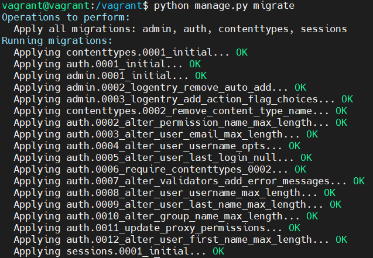

> 如果在数据迁移过程中出现`django.db.utils.OperationalError: (1045, "Access denied for user 'root'@'localhost' (using password: YES)")`类似的错误。可以检查一个Mysql的密码和项目 `twitter/settings.py`中的设置的数据库密码是否一致。

### 4. 修改 provision.sh 文件并执行

修改 `provision.sh` 文件，新增了51~68行的内容：

```bash
#!/usr/bin/env bash

echo 'Start!'

sudo update-alternatives --install /usr/bin/python python /usr/bin/python3.6 2

cd /vagrant

sudo apt-get update
sudo apt-get install tree

# 安装配置mysql8
if ! [ -e /vagrant/mysql-apt-config_0.8.15-1_all.deb ]; then
	wget -c https://dev.mysql.com/get/mysql-apt-config_0.8.15-1_all.deb
fi

sudo dpkg -i mysql-apt-config_0.8.15-1_all.deb
sudo DEBIAN_FRONTEND=noninteractivate apt-get install -y mysql-server
sudo apt-get install -y libmysqlclient-dev

if [ ! -f "/usr/bin/pip" ]; then
  sudo apt-get install -y python3-pip
  sudo apt-get install -y python-setuptools
  sudo ln -s /usr/bin/pip3 /usr/bin/pip
else
  echo "pip3 已安装"
fi

# 升级pip，目前存在问题，read timed out，看脸，有时候可以，但大多时候不行
# python -m pip install --upgrade pip
# 换源完美解决
# 安装pip所需依赖
pip install --upgrade setuptools -i https://pypi.tuna.tsinghua.edu.cn/simple
pip install --ignore-installed wrapt -i https://pypi.tuna.tsinghua.edu.cn/simple
# 安装pip最新版
pip install -U pip -i https://pypi.tuna.tsinghua.edu.cn/simple
# 根据 requirements.txt 里的记录安装 pip package，确保所有版本之间的兼容性
pip install -r requirements.txt -i https://pypi.tuna.tsinghua.edu.cn/simple


# 设置mysql的root账户的密码为yourpassword
# 创建名为twitter的数据库
sudo mysql -u root << EOF
	ALTER USER 'root'@'localhost' IDENTIFIED WITH mysql_native_password BY 'yourpassword';
	flush privileges;
	show databases;
	CREATE DATABASE IF NOT EXISTS twitter;
EOF
# fi

# superuser名字
USER="admin"
# superuser密码
PASS="admin"
# superuser邮箱
MAIL="admin@twitter.com"
script="
from django.contrib.auth.models import User;
username = '$USER';
password = '$PASS';
email = '$MAIL';
if not User.objects.filter(username=username).exists():
    User.objects.create_superuser(username, email, password);
    print('Superuser created.');
else:
    print('Superuser creation skipped.');
"
printf "$script" | python manage.py shell


# 如果想直接进入/vagrant路径下
# 请输入vagrant ssh命令进入
# 手动输入
# 输入ls -a
# 输入 vi .bashrc
# 在最下面，添加cd /vagrant

echo 'All Done!'
```

> 此处需要注意：项目的 settings.py 中配置的 Mysql 密码要和我们 provision.sh 中配置的密码一样
>
> 比如 provision.sh 脚本通过如下语句： `ALTER USER 'root'@'localhost' IDENTIFIED WITH mysql_native_password BY 'yourpassword';` 将 Mysql的密码设为 yourpassword，那你要保持 seetings.py 文件中的 Mysql 密码也是这一个。
>
> 如果出现 `ERROR 1045 (28000): Access denied for user 'root'@'localhost' (using password: YES)` 这样的错误，是因为你的项目的settings.py 文件中配置的数据库密码和数据库的实际密码不一致，数据库 root 默认密码是 yourpassword，去修改一下 `twitter/settings.py` 文件中 `DATABASES` 相关的密码选项
>
> TIPS：我们用的是虚拟机中的 Mysql，和物理机没关系

断开虚拟机连接，使用下面的命令重新执行脚本：

```shell
vagrant provision
```

> Vagrant 是安装物理机中，所以要执行这个虚拟机中执行该命令。
>
> 但是不要关系虚拟机哦，断开虚拟机连接只是为了在物理机的环境下执行命令，你也可以重开一个物理机的的终端窗口，或者在虚拟机的终端中输入 exit 就会回退到物理机的终端。

### 5. 运行项目

好了，让我们来运行我们的项目吧！让它跑起来可以被我们的浏览器访问到。运行项目使用过 python 调用 manage.py 文件 并配置相应的 runserver 参数。

我们可以在虚拟机的终端直接通过命令来运行项目，也可以在Pycharm 中通过点按钮的方式来运行项目。


#### **在虚拟机终端上运行项目**

我们重新连接虚拟机，进入 `/vagrant` 目录，并执行如下命令，运行我们的项目：

```shell
python manage.py runserver 0.0.0.0:8000
```

> 我们使用的是虚拟机中的 python ，所以该命令要在虚拟机的环境中执行

如果运行成功，我们可以看到如下画面

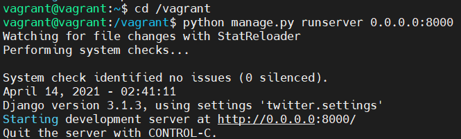

在宿主机的浏览器中输入 `localhost`，可以看到 Django 启动成功的界面

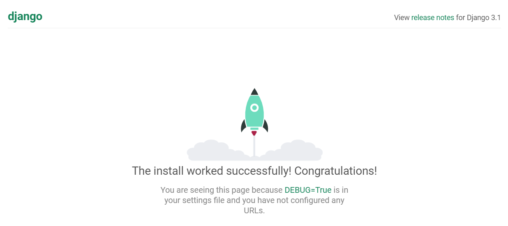

当不需要运行的时候，可以按下 ctrl+c 来结束项目，mac下是control+c


#### **在Pycharm上运行项目**

如果在虚拟机的终端上输入运行命令觉得太麻烦的话，可以通过 Pycharm 来运行，（Pycharm 背后也是通过输入 python manage.py runserver ，但是不需要我们手动输入了），我们需要在 PyCharm 上配置一下 Vagrant 的 Python 解释器。首先点击“小扳手”按钮，然后在左侧点击 “Python Interpreter” 按钮，在右侧红框的位置点击“小齿轮”按钮，然后点击“Add”。

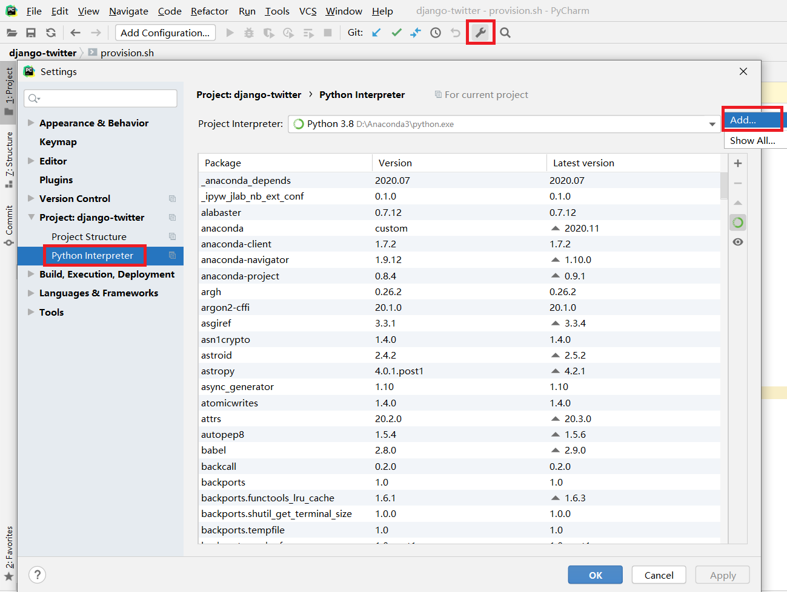

然后在左侧选择 Vagrant，右侧 Vagrant Instance Folder 选择 `django-twitter` 所在的路径，然后点击 “OK”。

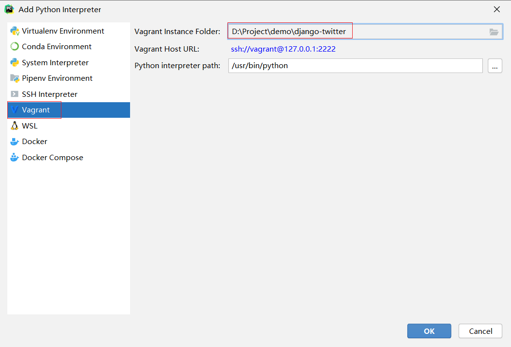

然后再次点击 “OK”，解释器配置完毕。

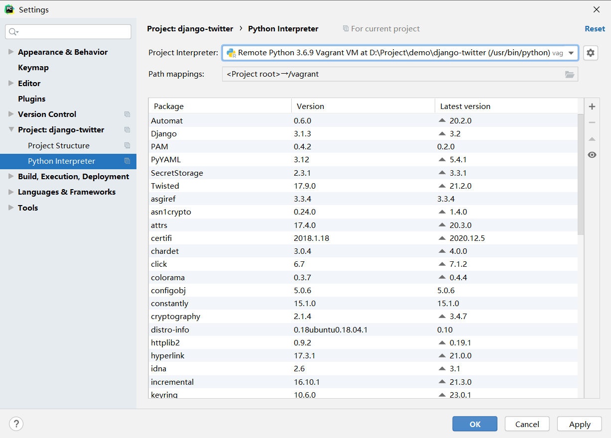

接着 PyCharm 会去导入虚拟机上的 Python 环境，这可能需要花一段时间。等导入结束后，我们还需要对 Run/Debug 进行配置，首先点击 “Add Configuration”，然后点击 + 号，选择 “Django Server”。

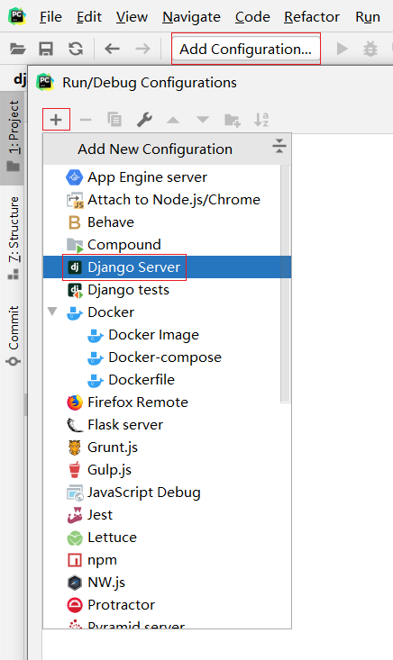

接着配置 “Name” 和 “Host”，然后可能需要修复一下 Django 依赖，点击 “Fix”。

> 这里的 Host 设为 `0.0.0.0` 很重要，千万别忘了点 `Apply`

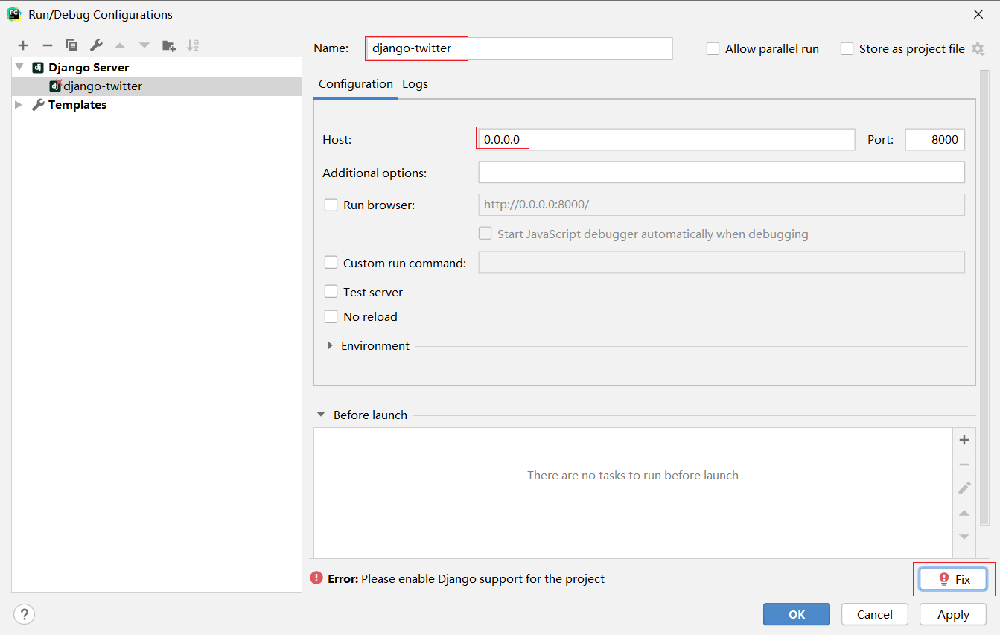

首先勾选 “Enable Django Support”，然后指定 Django 的根目录和 `settings.py` 所在的路径，点击 “OK”。

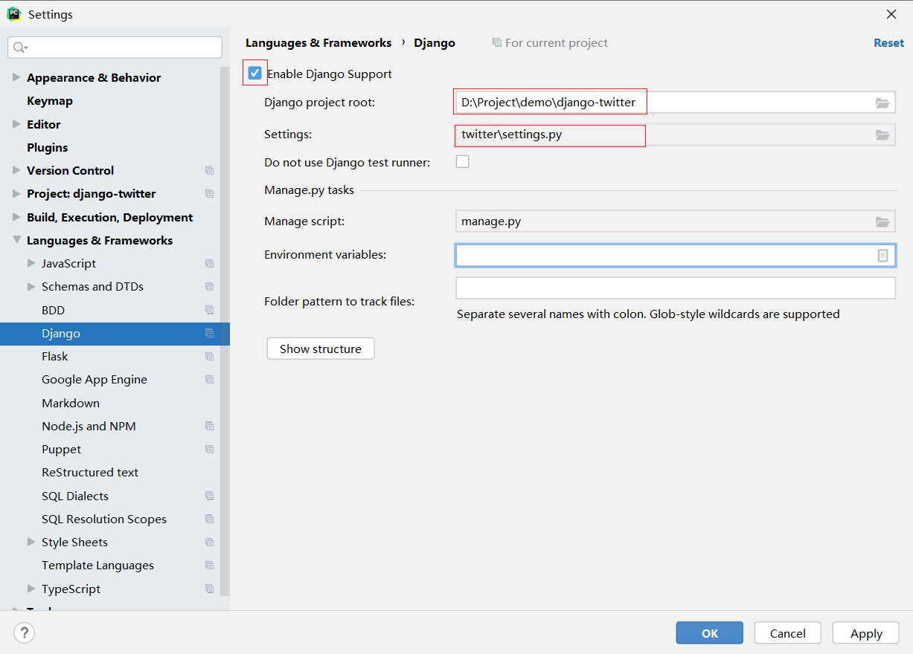

然后我们就可以通过 PyCharm 来运行我们的项目代码了，点击绿色的三角形

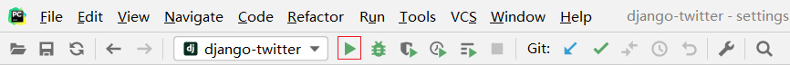

如果你看到如下信息，就说明项目运行成功了。

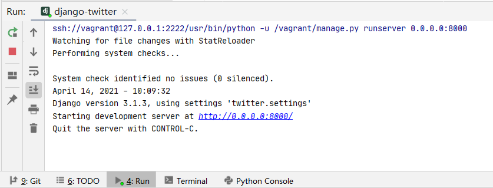

接着在宿主机的浏览器中输入 `localhost`，同样可以看到 Django 启动成功的界面


现在初始化 Django 项目完成了，我们同样需要把代码更新到 github 上。

> 如果此处你不能通过浏览器访问，显示 `ERROR：That port is already in use` ，那说明你没有把之前在虚拟机终端中跑起来的项目关停。那个运行监听了 8000，你又在 pycharm 中再次运行，同样监听8000 端口就冲突了。把原来那个关掉吧！

## 接入 Django Rest Framework

### 1. 增加依赖

首先我们需要修改 `requirements.txt` 文件，增加第三方库 `djangorestframework` 。

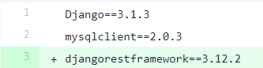

接下来我们可以安装 `djangorestframework` ，有如下两种方式：

- **在 PyCharm 中安装**

  当在 `requirements.txt` 文件中新增一个依赖时，PyCharm 会非常智能地提示你去安装这个依赖。

  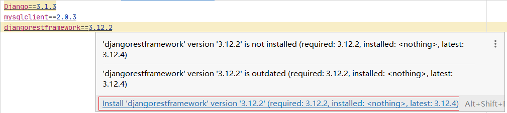

  或者在你去调用这个依赖时，会提示你安装

  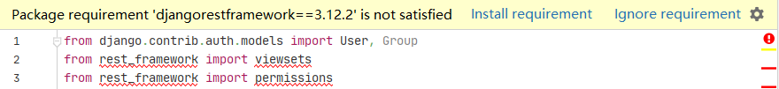

- **在 Vagrant 中安装**

  我们可以在虚拟机中直接执行以下命令安装：

  ```shell
  pip install -r requirements.txt
  ```
  
  > 我们使用的是虚拟机中的 pip ，所以该命令要在虚拟机的环境中执行


  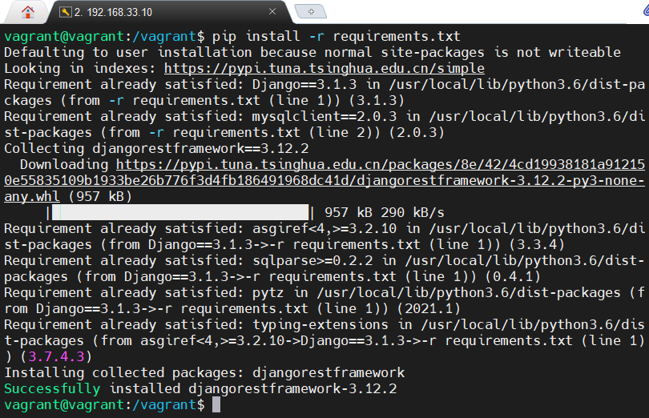

安装完依赖后，我们还需要在 `settings.py` 文件中进行一些修改**（注意在开始新的开发工作之前，一定要创建新的分支，一定要创建新的分支，一定要创建新的分支！重要的事情说三遍）**。

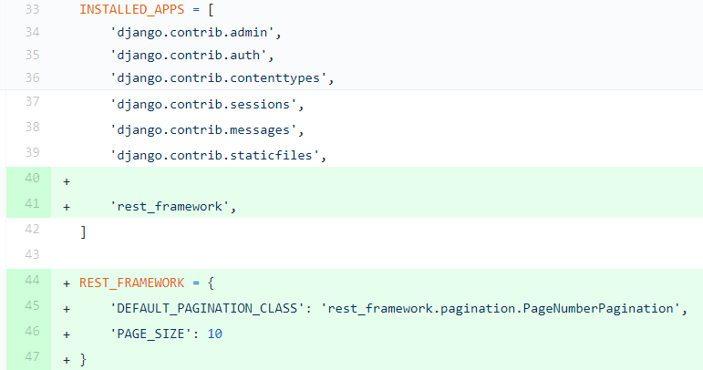

> 一定要确保 `settings.py` 文件中的 `INSTALLED_APPS` 中配置了 `'rest_framework'` ，否则之后访问页面是会出现 `TemplateDoesNotExist` 的错误。

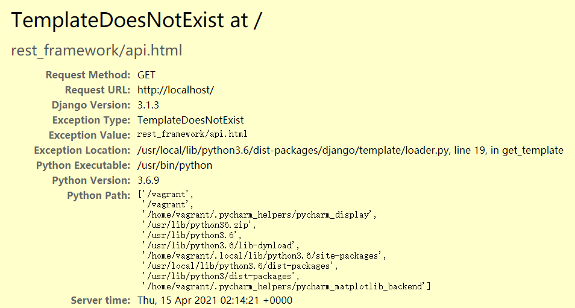


### 2. 新增 app — accounts

我们可以使用以下命令新建一个 app：

```shell
python manage.py startapp accounts
```

> 我们使用的是虚拟机中的 python ，所以该命令要在虚拟机的环境中执行

可以看到在当前路径下，多了一个 `accounts` 的文件夹。

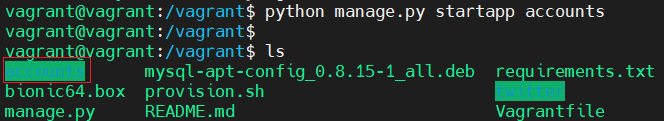

然后我们会在 `accounts` 文件夹下对默认生成的目录结构进行一些改动，首先在 `accounts` 文件夹下新建一个文件夹 `api` ，用于存放视图、序列化器等文件。

可以用如下命令新建文件夹：

```shell
cd accounts/   # 首先要进入 accounts 中
mkdir api
```

可以看到在当前路径下，多了一个 `api` 文件夹

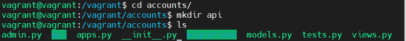

接下来我们需要，对我们的代码就行一些修改，首先在 `api` 文件下新建一个 `__init__.py` 文件，表示 `api` 文件夹是一个包。

```bash
cd api
> __init__.py
```

> 注意 `__init__.py` 是前后两个下划线，这个文件里面不需要有内容，空的就行，但是必不可少，没有这个文件，`api`就只是一个文件夹而不是一个 `Python包`

然后在 `api` 文件下增加一个视图文件 `views.py`:

```python
from django.contrib.auth.models import User, Group
from rest_framework import viewsets
from rest_framework import permissions
from accounts.api.serializers import UserSerializer


class UserViewSet(viewsets.ModelViewSet):
    """
    API endpoint that allows users to be viewed or edited.
    """
    queryset = User.objects.all().order_by('-date_joined')
    serializer_class = UserSerializer
    permission_classes = [permissions.IsAuthenticated]
```

然后在 `api` 文件下增加一个序列化器文件 `serializers.py` ：

```python
from django.contrib.auth.models import User, Group
from rest_framework import serializers


class UserSerializer(serializers.HyperlinkedModelSerializer):
    class Meta:
        model = User
        fields = ['url', 'username', 'email']
```

最后我们还需要修改 `twitter/urls.py` 文件：

```python
from django.contrib import admin
from django.urls import include, path
from rest_framework import routers
from accounts.api import views

router = routers.DefaultRouter()
router.register(r'api/users', views.UserViewSet)

urlpatterns = [
    path('admin/', admin.site.urls),
    path('', include(router.urls)),
    path('api-auth/', include('rest_framework.urls', namespace='rest_framework')),
]
```

修改完成后，我们可以在宿主机的浏览器端访问 `localhost` ，即可以看到如下界面

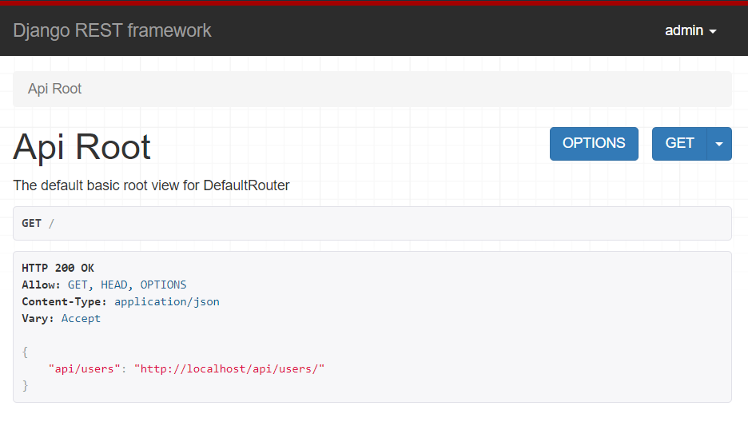

> 如果你遇到了图片中的问题，大概率你没有设置 0.0.0.0 而设置 127.0.0.1
>
> 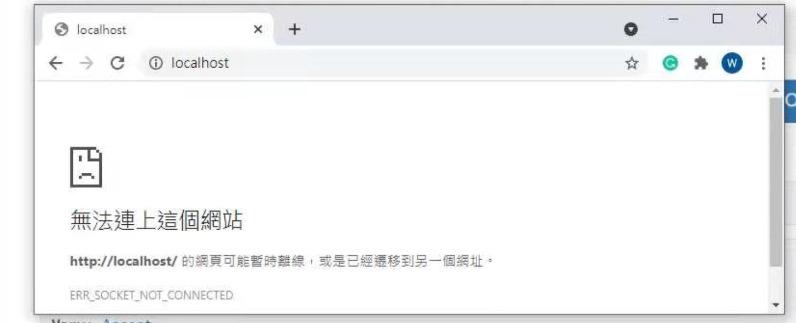


## 实现注册、登录、登出功能

接下来我们要实现注册、登录和登出的功能，首先我们先来修改一下 `settings.py` 文件：

```python
INSTALLED_APPS = [
    'django.contrib.admin',
    'django.contrib.auth',
    'django.contrib.contenttypes',
    'django.contrib.sessions',
    'django.contrib.messages',
    'django.contrib.staticfiles',
    # third party
    'rest_framework',

    # project apps
    'accounts',
]
```

如上述代码所示，我们增加了一下代码，并将之前创建的应用注册到了 Django 中。

然后我们会修改 `accounts/api/views.py` 中的 `UserViewSet` ：

```python
class UserViewSet(viewsets.ReadOnlyModelViewSet):
    """
    API endpoint that allows users to be viewed or edited.
    """
    queryset = User.objects.all().order_by('-date_joined')
    serializer_class = UserSerializer
    permission_classes = (permissions.IsAuthenticated,)
```

并且修改 `accounts/api/serializers.py` 中的 `UserSerializer` ：

```python
class UserSerializer(serializers.ModelSerializer):
    class Meta:
        model = User
        fields = ('username', 'email')
```

接下来让我们开始写注册、登录、登出和查看登录状态的接口（API）吧！

首先我们先展示一下 `accounts/api/views.py` 会导入的包：

```python
from accounts.api.serializers import UserSerializer
from django.contrib.auth.models import User
from rest_framework import permissions
from rest_framework import viewsets
from rest_framework.response import Response
from rest_framework.decorators import action
from rest_framework.permissions import AllowAny
from django.contrib.auth import (
    authenticate as django_authenticate,
    login as django_login,
    logout as django_logout,
)
from accounts.api.serializers import SignupSerializer, LoginSerializer
```

以及 `accounts/api/serializers.py` 中导入的包：

```python
from django.contrib.auth.models import User
from rest_framework import serializers, exceptions
```


### 1. 注册

接着让我们来看看如何实现一个**注册**功能，在 `accounts/api/views.py` 增加如下代码：

```python
class AccountViewSet(viewsets.ViewSet):
    permission_classes = (AllowAny,)
    serializer_class = SignupSerializer
    
		@action(methods=['POST'], detail=False)
    def signup(self, request):
        """
        使用 username, email, password 进行注册
        """
        # 不太优雅的写法
        # username = request.data.get('username')
        # if not username:
        #     return Response("username required", status=400)
        # password = request.data.get('password')
        # if not password:
        #     return Response("password required", status=400)
        # if User.objects.filter(username=username).exists():
        #     return Response("password required", status=400)
        serializer = SignupSerializer(data=request.data)
        if not serializer.is_valid():
            return Response({
                'success': False,
                'message': "Please check input",
                'errors': serializer.errors,
            }, status=400)

        user = serializer.save()
        django_login(request, user)
        return Response({
            'success': True,
            'user': UserSerializer(user).data,
        })
```

注册中用到的 `SignupSerializer` 在 `accounts/api/serializers.py` 中：

```python
class SignupSerializer(serializers.ModelSerializer):
    username = serializers.CharField(max_length=20, min_length=6)
    password = serializers.CharField(max_length=20, min_length=6)
    email = serializers.EmailField()

    class Meta:
        model = User
        fields = ('username', 'email', 'password')

    def validate(self, data):
        # TODO<HOMEWORK> 增加验证 username 是不是只由给定的字符集合构成
        if User.objects.filter(username=data['username'].lower()).exists():
            raise exceptions.ValidationError({
                'message': 'This email address has been occupied.'
            })
        if User.objects.filter(email=data['email'].lower()).exists():
            raise exceptions.ValidationError({
                'message': 'This email address has been occupied.'
            })
        return data

    def create(self, validated_data):
        username = validated_data['username'].lower()
        email = validated_data['email'].lower()
        password = validated_data['password']

        user = User.objects.create_user(
            username=username,
            email=email,
            password=password,
        )
        return user
```


### 2. 登录

接着让我们来看看如何实现一个**登录**功能，在 `accounts/api/views.py`  中的 `AccountViewSet` 视图类下增加一个 `login` 方法：

```python
    @action(methods=['POST'], detail=False)
    def login(self, request):
        """
        默认的 username 是 admin, password 也是 admin
        """
        serializer = LoginSerializer(data=request.data)
        if not serializer.is_valid():
            return Response({
                "success": False,
                "message": "Please check input",
                "errors": serializer.errors,
            }, status=400)
        username = serializer.validated_data['username']
        password = serializer.validated_data['password']
        user = django_authenticate(username=username, password=password)
        if not user or user.is_anonymous:
            return Response({
                "success": False,
                "message": "username and password does not match",
            }, status=400)
        django_login(request, user)
        return Response({
            "success": True,
            "user": UserSerializer(instance=user).data,
        })
```

登录中用到的 `LoginSerializer` 在 `accounts/api/serializers.py` 中：

```python
class LoginSerializer(serializers.Serializer):
    username = serializers.CharField()
    password = serializers.CharField()
```


### 3. 查看登录状态

接着让我们来看看如何实现一个**查看登录状态**功能，在 `accounts/api/views.py`  中的 `AccountViewSet` 视图类下增加一个 `login_status` 方法：

```python
    @action(methods=['GET'], detail=False)
    def login_status(self, request):
        """
        查看用户当前的登录状态和具体信息
        """
        data = {'has_logged_in': request.user.is_authenticated}
        if request.user.is_authenticated:
            data['user'] = UserSerializer(request.user).data
        return Response(data)
```


### 4. 登出

接着让我们来看看如何实现一个**登出**功能，在 `accounts/api/views.py`  中的 `AccountViewSet` 视图类下增加一个 `logout` 方法：

```python
    @action(methods=['POST'], detail=False)
    def logout(self, request):
        """
        登出当前用户
        """
        django_logout(request)
        return Response({"success": True})
```


### 5. 注册路由

修改 `twitter/urls.py` 文件，为我们新写的视图类 `AccountViewSet` 注册路由：

```python
router.register(r'api/accounts', views.AccountViewSet, basename='accounts')
```


到目前为止，我们已经实现了注册、登录、登出和查看登录状态的功能，让我们来验证一下吧！打开宿主机上的浏览器，输入 `http://localhost/api/accounts/signup` 来访问注册页面。

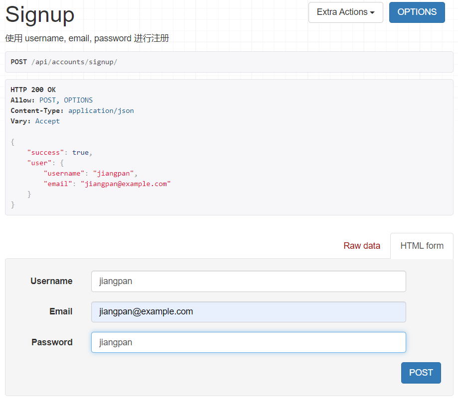


> 注意，当你在浏览器中输入 `http://localhost/api/accounts/signup` 的时候，是使用 GET 方法，所以会显示 `"detail":"Method \"GET\" not allowed`，这是正确的，注册是一个新建数据记录的操作，所以需要使用 POST 方法，而不是 GET


输入 `http://localhost/api/accounts/login` 来访问登录页面。

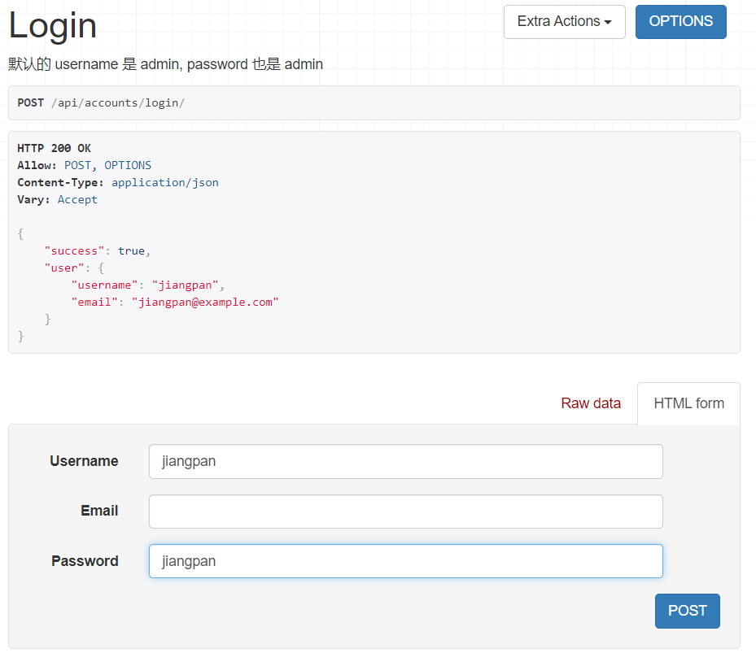

输入 `http://localhost/api/accounts/login_status` 来访问查看登录状态页面，可以看到我们目前是正在登录状态。

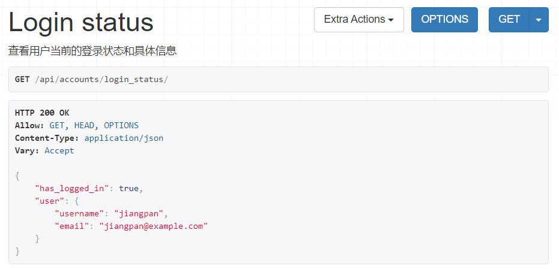

输入 `http://localhost/api/accounts/logout` 来访问登出页面。

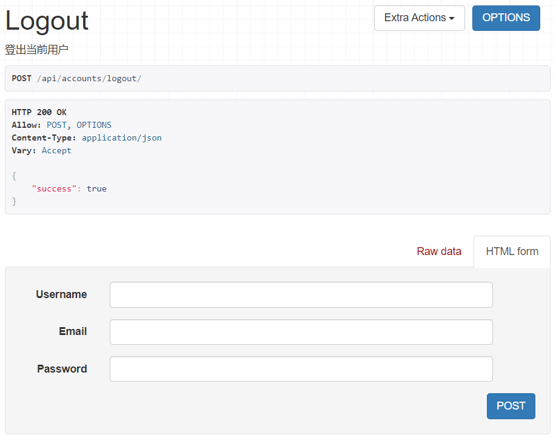

再次输入 `http://localhost/api/accounts/login_status` 来查看登录状态，可以看到我们现在是未登录状态。

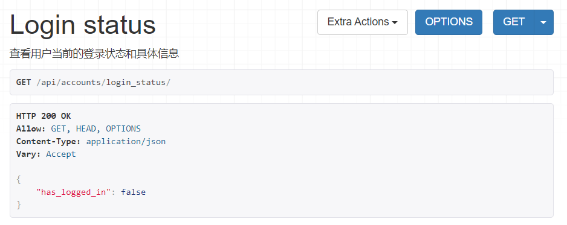


## 单元测试

首先在 `accounts/api` 下新建一个 `tests.py` 文件，首先先列出写单元测试会导入的包以及常量 (这部分可以先不用看，到时候用到再回来看就行)：

```python
from django.test import TestCase
from rest_framework.test import APIClient
from django.contrib.auth.models import User


LOGIN_URL = '/api/accounts/login/'
LOGOUT_URL = '/api/accounts/logout/'
SIGNUP_URL = '/api/accounts/signup/'
LOGIN_STATUS_URL = '/api/accounts/login_status/'
```

然后再在 `tests.py` 文件中创建一个单元测试类 `AccountApiTests` ，并实现它生成测试数据的功能：

```python
class AccountApiTests(TestCase):

    def setUp(self):
        # 这个函数会在每个 test function 执行的时候被执行
        self.client = APIClient()
        self.user = self.createUser(
            username='admin',
            email='admin@jiuzhang.com',
            password='correct password',
        )

    def createUser(self, username, email, password):
        # 不能写成 User.objects.create()
        # 因为 password 需要被加密, username 和 email 需要进行一些 normalize 处理
        return User.objects.create_user(username, email, password)
```

接着我们来实现测试登录的功能，在 `AccountApiTests` 类下添加 `test_login` 方法：

```python
    def test_login(self):
        # 每个测试函数必须以 test_ 开头，才会被自动调用进行测试
        # 测试必须用 post 而不是 get
        response = self.client.get(LOGIN_URL, {
            'username': self.user.username,
            'password': 'correct password',
        })
        # 登陆失败，http status code 返回 405 = METHOD_NOT_ALLOWED
        self.assertEqual(response.status_code, 405)

        # 用了 post 但是密码错了
        response = self.client.post(LOGIN_URL, {
            'username': self.user.username,
            'password': 'wrong password',
        })
        self.assertEqual(response.status_code, 400)

        # 验证还没有登录
        response = self.client.get(LOGIN_STATUS_URL)
        self.assertEqual(response.data['has_logged_in'], False)
        # 用正确的密码
        response = self.client.post(LOGIN_URL, {
            'username': self.user.username,
            'password': 'correct password',
        })
        self.assertEqual(response.status_code, 200)
        self.assertNotEqual(response.data['user'], None)
        self.assertEqual(response.data['user']['email'], 'admin@jiuzhang.com')
        # 验证已经登录了
        response = self.client.get(LOGIN_STATUS_URL)
        self.assertEqual(response.data['has_logged_in'], True)
```

同样添加 `test_logout` 方法来测试登出：

```python
    def test_logout(self):
        # 先登录
        self.client.post(LOGIN_URL, {
            'username': self.user.username,
            'password': 'correct password',
        })
        # 验证用户已经登录
        response = self.client.get(LOGIN_STATUS_URL)
        self.assertEqual(response.data['has_logged_in'], True)

        # 测试必须用 post
        response = self.client.get(LOGOUT_URL)
        self.assertEqual(response.status_code, 405)

        # 改用 post 成功 logout
        response = self.client.post(LOGOUT_URL)
        self.assertEqual(response.status_code, 200)
        # 验证用户已经登出
        response = self.client.get(LOGIN_STATUS_URL)
        self.assertEqual(response.data['has_logged_in'], False)
```

以及添加 `test_signup` 方法来测试注册：

```python
 def test_signup(self):
        data = {
            'username': 'someone',
            'email': 'someone@jiuzhang.com',
            'password': 'any password',
        }
        # 测试 get 请求失败
        response = self.client.get(SIGNUP_URL, data)
        self.assertEqual(response.status_code, 405)

        # 测试错误的邮箱
        response = self.client.post(SIGNUP_URL, {
            'username': 'someone',
            'email': 'not a correct email',
            'password': 'any password'
        })
        # print(response.data)
        self.assertEqual(response.status_code, 400)

        # 测试密码太短
        response = self.client.post(SIGNUP_URL, {
            'username': 'someone',
            'email': 'someone@jiuzhang.com',
            'password': '123',
        })
        # print(response.data)
        self.assertEqual(response.status_code, 400)

        # 测试用户名太长
        response = self.client.post(SIGNUP_URL, {
            'username': 'username is tooooooooooooooooo loooooooong',
            'email': 'someone@jiuzhang.com',
            'password': 'any password',
        })
        # print(response.data)
        self.assertEqual(response.status_code, 400)

        # 成功注册
        response = self.client.post(SIGNUP_URL, data)
        self.assertEqual(response.status_code, 201)
        self.assertEqual(response.data['user']['username'], 'someone')
        # 验证用户已经登入
        response = self.client.get(LOGIN_STATUS_URL)
        self.assertEqual(response.data['has_logged_in'], True)
```

单元测试添加完毕，让我们来运行单元测试，看看我们的 API 是否能正常工作吧！在虚拟机的项目根目录下执行如下命令：

```shell
python manage.py test
```

如下图所示，共执行了三个测试，并全部通过。

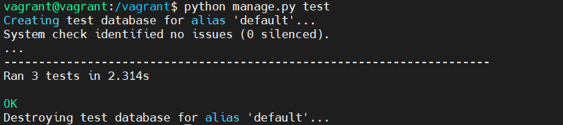


> 如果报 201错误，可以观察一下`4-user-authentication-api`和`5-accounts-api-unit-tests`的`views.py`文件的区别

本教程已结束


-------------------------


补充一些再下面的课程中会用到的一些知识点：

# 知识点补充

## 关于迁移文件

在教程前面的 初始化项目-执行数据迁移 那一部分，我们执行了 `python manage.py migrate` 命令，除此之外在后面的教程中还有 `python manage.py makemigrations` 命令。

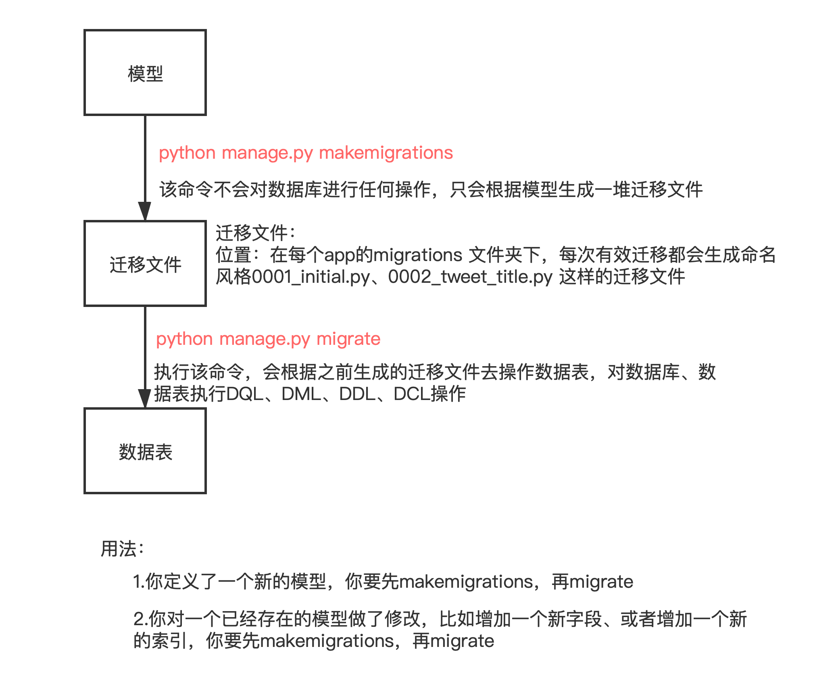